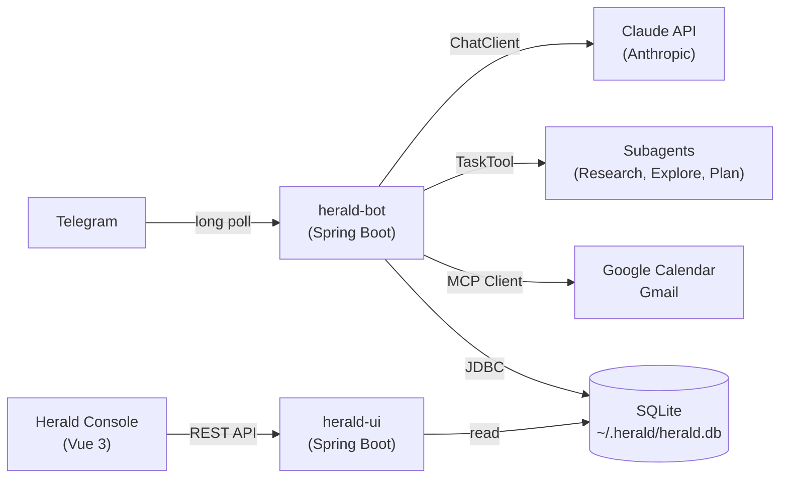
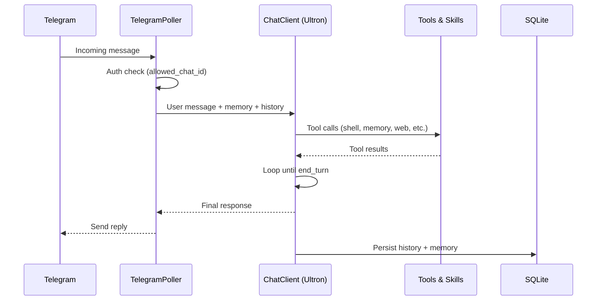
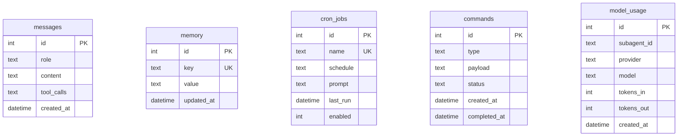

<p align="center">
  
</p>

# Herald

**Personal AI Assistant** — a single-user, always-on AI agent that lives in Telegram and runs 24/7 on your Mac.


> An AI agent that knows who you are, runs on your machine, can do things on your behalf, and reaches out to you — not just the other way around.

## Architecture



Herald is a Spring Boot monorepo producing two runnable JARs:

| Service | Role | Port |
|---------|------|------|
| **herald-bot** | Telegram bot, agent loop, tools, cron | — |
| **herald-ui** | Management console (REST API + Vue 3) | 8080 |

Both run as macOS `launchd` services and share a single SQLite database.

## Features

- **Telegram-native** — chat with your AI assistant where you already message
- **Persistent memory** — remembers your context, preferences, and history across sessions
- **Skills system** — extensible via Markdown files in `.claude/skills/` (Claude Code compatible)
- **Subagent delegation** — routes complex research to specialist agents via TaskTool
- **Proactive scheduling** — morning briefings, reminders, and cron-driven outreach
- **Shell & file access** — executes commands on your Mac with security guardrails
- **MCP integration** — Google Calendar and Gmail via MCP servers
- **Multi-provider** — Anthropic, OpenAI, and Ollama models, switchable at runtime
- **Management console** — Vue 3 web UI for skills editing, memory, cron, and status

## Data Flow



## Prerequisites

- **macOS** (designed for always-on Mac)
- **Java 21** (JDK)
- **Maven 3.9+**
- **Telegram Bot Token** (from [@BotFather](https://t.me/BotFather))
- **Anthropic API Key**
- **Node.js 20+** and **npm** (for Console frontend build)

## Quick Start

### 1. Clone and build

```bash
git clone https://github.com/dbbaskette/herald.git
cd herald
mvn package -DskipTests
```

### 2. Configure

```bash
mkdir -p ~/.herald
cp herald.yaml.example ~/.herald/herald.yaml
```

Edit `~/.herald/herald.yaml` with your credentials, or set environment variables:

```bash
export TELEGRAM_BOT_TOKEN="your-bot-token"
export ANTHROPIC_API_KEY="your-api-key"
```

### 3. Run locally

```bash
# Bot
mvn -pl herald-bot spring-boot:run

# Console (separate terminal)
cd herald-ui/frontend && npm install && npm run build && cd ../..
mvn -pl herald-ui spring-boot:run
```

### 4. Install as service (optional)

```bash
make build
make install      # Installs herald-bot launchd service
make install-ui   # Installs herald-ui launchd service
```

## Environment Variables

| Variable | Description | Required |
|----------|-------------|----------|
| `TELEGRAM_BOT_TOKEN` | Bot token from @BotFather | Yes |
| `ANTHROPIC_API_KEY` | Anthropic API key | Yes |
| `OPENAI_API_KEY` | OpenAI API key | No |
| `GCAL_MCP_URL` | Google Calendar MCP server URL | No |
| `GMAIL_MCP_URL` | Gmail MCP server URL | No |
| `HERALD_CONFIG` | Override config path (default: `~/.herald/herald.yaml`) | No |

## Project Structure

```
herald/
├── pom.xml                          # Parent POM — Spring AI BOM
├── herald-bot/                      # Core bot service
│   └── src/main/java/com/herald/
│       ├── HeraldApplication.java
│       ├── agent/                   # ChatClient config, agent service
│       ├── telegram/                # Poller, commands, formatting
│       ├── memory/                  # Memory tools (@Tool beans)
│       ├── tools/                   # Shell decorator, web tools
│       ├── cron/                    # Cron service, briefing jobs
│       └── config/                  # Configuration properties
├── herald-ui/                       # Management console
│   ├── src/main/java/com/herald/ui/
│   │   ├── api/                     # REST controllers
│   │   └── sse/                     # SSE status stream
│   └── frontend/                    # Vue 3 + Vite
│       └── src/pages/
│           ├── SkillsEditor.vue
│           ├── SystemStatus.vue
│           ├── MemoryViewer.vue
│           ├── CronBuilder.vue
│           └── ConversationHistory.vue
├── .claude/
│   ├── agents/                      # Subagent definitions (*.md)
│   └── skills/                      # Skills (Claude Code compatible)
├── com.herald.plist                  # launchd: bot
├── com.herald-ui.plist              # launchd: console
└── Makefile
```

## Telegram Commands

| Command | Description |
|---------|-------------|
| `/help` | Show all available commands |
| `/status` | System status: uptime, model, MCP connections |
| `/memory list` | Display all stored memory entries |
| `/memory set <key> <value>` | Manually set a memory entry |
| `/memory clear` | Clear all memory (with confirmation) |
| `/skills list` | Show all loaded skills |
| `/skills reload` | Force reload skills from disk |
| `/cron list` | List all cron jobs with schedules |
| `/cron enable/disable <name>` | Toggle a cron job |
| `/model <provider> <model>` | Switch model at runtime |
| `/model status` | Show current provider and model |
| `/debug` | Context size, memory count, tools count |
| `/reset` | Clear conversation history (not memory) |

## Technology Stack

| Component | Technology |
|-----------|------------|
| Language | Java 21 (virtual threads) |
| Framework | Spring Boot 4.0.x |
| AI Framework | Spring AI 2.0.0-M2 |
| Agent Utils | spring-ai-agent-utils 0.4.2+ |
| Telegram | pengrad/java-telegram-bot-api |
| Database | SQLite (WAL mode) |
| Console Frontend | Vue 3 + Vite + Tailwind CSS |
| Console Backend | Spring MVC + SSE |
| Process Management | macOS launchd |

## Database Schema



## Build Phases

| Phase | Focus | Key Deliverable |
|-------|-------|-----------------|
| 1 | Core Loop + Spring AI Foundation | Telegram ↔ Claude ↔ Tools end-to-end |
| 2 | Subagents + Multi-Provider | TaskTool delegation, Ollama support |
| 3 | Skills & Memory | SkillsTool hot-reload, CONTEXT.md, auto-memory |
| 4 | Proactive & MCP | Cron jobs, morning briefing, Calendar/Gmail |
| 5 | Herald Console | Vue 3 management UI with skills editor |
| 6 | Polish | Voice, vision, Docker sandbox, dark mode |

## License

Distributed under the MIT License. See [LICENSE](LICENSE) for details.
