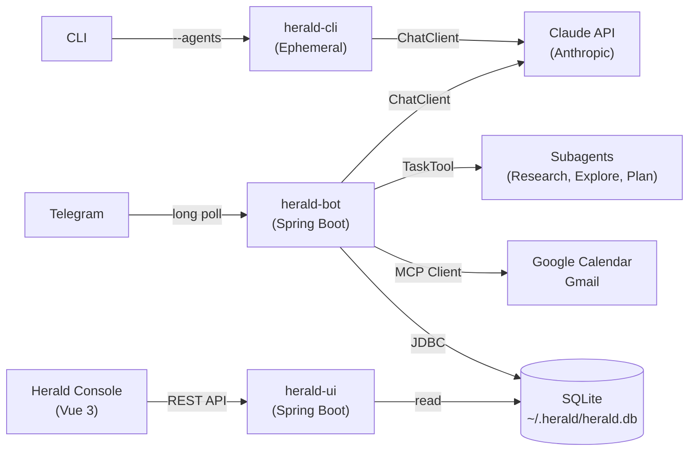
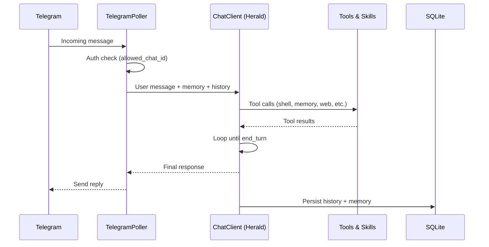
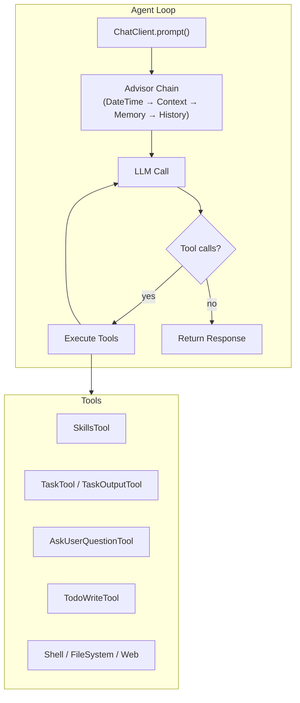
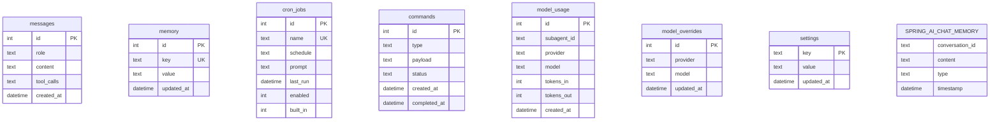

<p align="center">
  
</p>

# Herald

**Personal AI Assistant** — a single-user, always-on AI agent that lives in Telegram and runs 24/7 on your Mac.


> An AI agent that knows who you are, runs on your machine, can do things on your behalf, and reaches out to you — not just the other way around.

## Table of Contents

- [About](#about)
- [Features](#features)
- [Skills](#skills)
- [Architecture](#architecture)
- [Data Flow](#data-flow)
- [Getting Started](#getting-started)
- [Environment Variables](#environment-variables)
- [Ephemeral Mode](#ephemeral-mode)
- [Telegram Commands](#telegram-commands)
- [Project Structure](#project-structure)
- [Agentic Patterns](#agentic-patterns--spring-ai-agent-utils)
- [Technology Stack](#technology-stack)
- [Database Schema](#database-schema)
- [Build Phases](#build-phases)
- [Contributing](#contributing)
- [License](#license)

## About

Most AI assistants are stateless chat windows — you ask, they answer, they forget. Herald is different. It's a personal AI agent that runs continuously on your Mac, connects to you through Telegram, and builds a persistent understanding of who you are, what you care about, and what you need.

Herald can execute shell commands, manage your calendar and email, run scheduled tasks like morning briefings, and delegate complex research to specialized subagents — all while maintaining a growing memory of your preferences and context.

## Features

- **Telegram-native** — chat with your AI assistant where you already message
- **Persistent memory** — remembers your context, preferences, and history across sessions
- **Skills system** — extensible via Markdown files in `skills/` directory
- **Subagent delegation** — routes complex research to specialist agents via TaskTool
- **Proactive scheduling** — morning briefings, reminders, and cron-driven outreach
- **Shell & file access** — executes commands on your Mac with security guardrails
- **Google Workspace** — Gmail and Google Calendar via `gws` CLI
- **Multi-provider** — Anthropic, OpenAI, Ollama, and Gemini models, switchable at runtime
- **Obsidian integration** — cold memory storage, session archival, and research notes in an Obsidian vault
- **Management console** — Vue 3 web UI for skills editing, memory, cron, and status

## Skills

Skills are Markdown files with YAML front matter that teach Herald new capabilities without code changes. Drop a file into `skills/` and Herald picks it up immediately — no restart required.

```
skills/
├── broadcom/SKILL.md        # VMware/Broadcom knowledge base
├── github/SKILL.md          # GitHub workflow automation
├── gmail/SKILL.md           # Email composition & search
├── google-calendar/SKILL.md # Calendar management
├── google-drive/SKILL.md    # Drive file operations
├── obsidian/SKILL.md        # Obsidian vault integration
└── weather/SKILL.md         # Weather lookups
```

Each skill file follows this format:

```markdown
---
name: skill-name
description: What this skill does (shown to the LLM for selection)
---

Instructions, context, and examples that guide Herald's behavior
when this skill is activated by the agent.
```

Herald's `ReloadableSkillsTool` wraps the upstream `SkillsTool` with a `WatchService`-based filesystem watcher (`SkillsWatcher`) that triggers a 250ms debounced reload on any file change. The Herald Console also provides a web-based skills editor with live reload status via SSE.

## Architecture



Herald is a modular Spring Boot monorepo with 6 Maven modules producing 3 runnable JARs:

| Module | Role | Dependency |
|--------|------|------------|
| **herald-core** | Agentic loop, advisors, tools, AgentFactory | Spring AI |
| **herald-persistence** | SQLite, memory, cron, persistence advisors | herald-core + JDBC |
| **herald-telegram** | Telegram transport, commands, question handler | herald-core + herald-persistence |
| **herald-cli** | Ephemeral CLI runner (`--agents`, `--prompt`) | herald-core only |
| **herald-bot** | Thin wiring: assembles core + persistence + telegram | All modules |
| **herald-ui** | Management console (REST API + Vue 3) | herald-persistence |

| Executable | Use Case | Port |
|------------|----------|------|
| **herald-bot.jar** | Always-on Telegram bot with persistence | 8081 |
| **herald-cli.jar** | One-shot or REPL ephemeral agent | — |
| **herald-ui.jar** | Web management console | 8080 |

## Data Flow



## Getting Started

This guide walks you through setting up Herald from scratch — from creating a Telegram bot to running your first conversation.

### Prerequisites

Before you begin, make sure you have the following installed:

| Requirement | Version | Check Command |
|-------------|---------|---------------|
| **macOS** | Any recent version | — |
| **Java JDK** | 21+ | `java -version` |
| **Maven** | 3.9+ (or use included wrapper) | `./mvnw -version` |
| **Node.js** | 20+ | `node -v` |
| **npm** | 10+ | `npm -v` |

You will also need:

- **Anthropic API Key** — sign up at [console.anthropic.com](https://console.anthropic.com)
- **Telegram Bot Token** — create one via [@BotFather](https://t.me/BotFather) on Telegram

### Step 1: Create a Telegram Bot

1. Open Telegram and search for [@BotFather](https://t.me/BotFather)
2. Send `/newbot` and follow the prompts to name your bot
3. Copy the **bot token** BotFather gives you (you'll need this later)
4. Send a message to your new bot, then visit `https://api.telegram.org/bot<YOUR_TOKEN>/getUpdates` to find your **chat ID** in the response JSON

### Step 2: Clone and Build

```bash
git clone https://github.com/dbbaskette/herald.git
cd herald
./mvnw package -DskipTests
```

This builds all modules: `herald-core`, `herald-persistence`, `herald-telegram`, `herald-cli`, `herald-bot`, and `herald-ui`.

### Step 3: Configure Environment

```bash
cp .env.example .env
```

Open `.env` and fill in the three required values:

```bash
ANTHROPIC_API_KEY=sk-ant-...
HERALD_TELEGRAM_BOT_TOKEN=123456:ABC-DEF...
HERALD_TELEGRAM_ALLOWED_CHAT_ID=your-chat-id
```

The `.env.example` file documents all optional variables (additional AI providers, Google Workspace, agent behavior, etc.). The `.env` file is gitignored so your secrets stay local.

### Step 4: Run Herald

**Using the run script** (recommended — auto-loads `.env`):

```bash
./run.sh          # starts both bot + ui (default)
./run.sh bot      # starts herald-bot only (port 8081)
./run.sh ui       # starts herald-ui only (port 8080)
./run.sh stop     # stops all herald services
./run.sh build    # builds all modules
```

**Or manually:**

```bash
source .env
make dev
```

Herald will start polling Telegram for messages. Open your bot in Telegram and send a message — you should get a response from Claude.

**Verify it's working:**

- Send `/status` in Telegram to see system info
- Send `/help` to see all available commands
- Try a natural language message like "What can you do?"

### Step 5: Install as a Service (Optional)

To run Herald 24/7 as a background service:

```bash
# Check that required env vars are set
make check-env

# Build, install, and start the launchd service
make install
```

This installs Herald as a macOS `launchd` agent that starts automatically on login.

Manage the service with:

```bash
make start       # Start the service
make stop        # Stop the service
make restart     # Restart the service
make logs        # Tail the log file
make uninstall   # Remove the service
```

Logs are written to `~/Library/Logs/herald.log`.

### Step 6: Set Up the Management Console (Optional)

The Herald Console provides a web UI for managing skills, memory, cron jobs, and viewing conversation history:

```bash
# Build the Vue 3 frontend
cd herald-ui/frontend && npm install && npm run build && cd ../..

# Run the console
./mvnw -pl herald-ui spring-boot:run
```

Open [http://localhost:8080](http://localhost:8080) in your browser.

### Step 7: Add Google Workspace Integration (Optional)

Herald supports Gmail and Google Calendar via the [Google Workspace CLI (`gws`)](https://www.npmjs.com/package/@googleworkspace/cli). See **[docs/gws-setup.md](docs/gws-setup.md)** for installation and authentication instructions.

## Environment Variables

| Variable | Description | Required | Default |
|----------|-------------|----------|---------|
| `ANTHROPIC_API_KEY` | Anthropic API key | Yes | — |
| `HERALD_TELEGRAM_BOT_TOKEN` | Bot token from @BotFather | Yes | — |
| `HERALD_TELEGRAM_ALLOWED_CHAT_ID` | Your Telegram chat ID | Yes | — |
| `OPENAI_API_KEY` | OpenAI API key | No | — |
| `GEMINI_API_KEY` | Google Gemini API key | No | — |
| `OLLAMA_BASE_URL` | Ollama server URL | No | — |
| `HERALD_DEFAULT_PROVIDER` | Boot-time provider (`anthropic`, `openai`, `ollama`, `gemini`) | No | `anthropic` |
| `HERALD_MODEL_DEFAULT` | Main agent model | No | `claude-sonnet-4-5` |
| `HERALD_MODEL_HAIKU` | Fast/cheap subagent tier | No | `claude-haiku-4-5` |
| `HERALD_MODEL_SONNET` | Mid-tier subagent | No | `claude-sonnet-4-5` |
| `HERALD_MODEL_OPUS` | High-capability subagent tier | No | `claude-opus-4-5` |
| `HERALD_MODEL_OPENAI` | OpenAI subagent tier | No | `gpt-4o` |
| `HERALD_MODEL_OLLAMA` | Ollama (local) subagent tier | No | `llama3.2` |
| `HERALD_MODEL_GEMINI` | Gemini subagent tier | No | `gemini-2.5-flash` |
| `GOOGLE_WORKSPACE_CLI_CLIENT_ID` | OAuth client ID for Gmail/Calendar | No | — |
| `GOOGLE_WORKSPACE_CLI_CLIENT_SECRET` | OAuth client secret | No | — |
| `HERALD_WEB_SEARCH_API_KEY` | Brave Search API key | No | — |
| `HERALD_CRON_TIMEZONE` | Timezone for cron scheduler | No | `America/New_York` |
| `HERALD_AGENT_PERSONA` | Override agent persona | No | Built-in default |
| `HERALD_AGENT_CONTEXT_FILE` | Path to standing brief | No | `~/.herald/CONTEXT.md` |
| `HERALD_WEATHER_LOCATION` | Location for weather tool | No | — |
| `HERALD_AGENT_MAX_CONTEXT_TOKENS` | Token limit before context compaction | No | `200000` |
| `HERALD_CONFIG` | Override config file path | No | `~/.herald/herald.yaml` |

## Ephemeral Mode

Herald can run without a database in ephemeral mode. Only `ANTHROPIC_API_KEY` is required.

### Quickstart: Ephemeral Mode

1. **Create an agent definition** (`my-agent.md`):
   ```yaml
   ---
   name: my-agent
   description: A helpful assistant
   model: sonnet
   tools: [filesystem, web]
   ---

   You are a helpful assistant with access to the filesystem and web.
   ```

2. **Set your API key:**
   ```bash
   export ANTHROPIC_API_KEY=sk-...
   ```

3. **Run it:**
   ```bash
   # Single prompt
   java -jar herald-cli.jar --agents=my-agent.md --prompt="List files in /tmp"

   # Interactive REPL
   java -jar herald-cli.jar --agents=my-agent.md
   ```

**Minimal configuration:**

```
ANTHROPIC_API_KEY=sk-...
```

**What's disabled in ephemeral mode:**
- No SQLite database (set `herald.memory.db-path` to enable persistence)
- No Telegram integration (set `herald.telegram.bot-token` to enable)
- No persistent memory, cron jobs, or chat history
- AskUserQuestion falls back to console stdin/stdout

**Full persistent mode requires:**

```
ANTHROPIC_API_KEY=sk-...
herald.memory.db-path=./herald.db
herald.telegram.bot-token=your-bot-token
```

## Telegram Commands

| Command | Description |
|---------|-------------|
| `/help` | Show all available commands |
| `/status` | System status: uptime, model, MCP connections |
| `/memory list` | Display all stored memory entries |
| `/memory set <key> <value>` | Manually set a memory entry |
| `/memory clear` | Clear all memory (with confirmation) |
| `/skills list` | Show all loaded skills |
| `/skills reload` | Force reload skills from disk |
| `/cron list` | List all cron jobs with schedules |
| `/cron enable/disable <name>` | Toggle a cron job |
| `/model <provider> <model>` | Switch model at runtime |
| `/model status` | Show current provider and model |
| `/debug` | Context size, memory count, tools count |
| `/reset` | Clear conversation history (not memory) |

## Project Structure

```
herald/
├── pom.xml                          # Parent POM — Spring AI BOM, 6 modules
├── Makefile                         # Build, install, service management
├── herald-core/                     # Agentic loop foundation (zero persistence deps)
│   └── src/main/java/com/herald/
│       ├── agent/                   # AgentFactory, AgentService, ModelSwitcher
│       │   ├── profile/             # AgentProfile record, AgentProfileParser
│       │   └── subagent/            # HeraldSubagentFactory, HeraldSubagentReferences
│       ├── tools/                   # FileSystemTools, WebTools, ShellSecurityConfig
│       └── config/                  # HeraldConfig, ModelProviderConfig
├── herald-persistence/              # SQLite, memory, cron
│   └── src/main/java/com/herald/
│       ├── memory/                  # MemoryTools, MemoryRepository, archival jobs
│       ├── cron/                    # CronService, CronTools, BriefingJob
│       ├── agent/                   # Persistence advisors, AgentMetrics
│       ├── tools/                   # HeraldShellDecorator, GwsTools
│       └── config/                  # DataSourceConfig, JsonChatMemoryRepository
├── herald-telegram/                 # Telegram transport
│   └── src/main/java/com/herald/
│       ├── telegram/                # Poller, sender, commands, question handler
│       └── tools/                   # TelegramSendTool
├── herald-cli/                      # Ephemeral CLI runner
│   └── src/main/java/com/herald/
│       ├── cli/                     # EphemeralRunner (--agents, --prompt)
│       └── agent/                   # ConsoleTodoProgressListener
├── herald-bot/                      # Thin wiring module (6 source files)
│   └── src/main/java/com/herald/
│       ├── HeraldApplication.java   # Spring Boot entry point
│       ├── agent/                   # HeraldAgentConfig (wiring)
│       └── api/                     # ChatController, ModelController
├── herald-ui/                       # Management console
│   ├── src/main/java/com/herald/ui/ # REST controllers, SSE
│   └── frontend/                    # Vue 3 + Vite
├── examples/                        # Example agents.md files
├── skills/                          # Reloadable skill definitions
├── .claude/agents/                  # Custom subagent definitions
└── docs/
    ├── agents-md-spec.md            # agents.md format specification
    ├── herald-patterns-comparison.md
    ├── gws-setup.md
    └── obsidian-setup.md
```

## Agentic Patterns — Spring AI Agent Utils

Herald is a reference implementation of the agentic patterns described in the [Spring AI Agentic Patterns](https://spring.io/blog/2026/01/13/spring-ai-generic-agent-skills/) blog series by Christian Tzolov. The series documents the [spring-ai-agent-utils](https://github.com/spring-ai-community/spring-ai-agent-utils) toolkit — a set of composable building blocks for AI agents, inspired by Claude Code's architecture. Herald adopts all five patterns, adapting each for a Telegram-native, always-on personal assistant.

> **Deep dive:** See **[docs/herald-patterns-comparison.md](docs/herald-patterns-comparison.md)** for a feature-by-feature comparison of every blog pattern against Herald's implementation, including what's adopted, what's customized, and what's planned.

### The Pattern

The core idea is that truly agentic behavior emerges from composition — not from a single monolithic prompt, but from a set of small, focused tools and advisors that the LLM orchestrates through its tool-calling loop:



### Pattern Coverage

| Pattern | Blog Post | Status | Herald Implementation |
|---------|-----------|--------|----------------------|
| **Agent Skills** | [Part 1: Modular, Reusable Capabilities](https://spring.io/blog/2026/01/13/spring-ai-generic-agent-skills/) | ✅ + ↗ | `ReloadableSkillsTool` wraps upstream `SkillsTool` with hot-reload via `WatchService` — an intentional divergence since upstream has no live-reload support. Skills live in `skills/` as Markdown with YAML front matter. File changes trigger a 250ms debounced reload. |
| **AskUserQuestion** | [Part 2: Agents That Clarify Before Acting](https://spring.io/blog/2026/01/16/spring-ai-ask-user-question-tool/) | ✅ | Upstream `AskUserQuestionTool` with `TelegramQuestionHandler` implementing `QuestionHandler`. Single-select options render as Telegram inline keyboard buttons; multi-select and free-text use text messaging. Blocks on `CompletableFuture` with 5-minute timeout. |
| **TodoWrite** | [Part 3: Why Your AI Agent Forgets Tasks](https://spring.io/blog/2026/01/20/spring-ai-agentic-patterns-3-todowrite) | ✅ | Upstream `TodoWriteTool` with structured states (`pending` → `in_progress` → `completed`). A `todoEventHandler` bridges to `TodoProgressEvent` → `TodoProgressListener` → Telegram for real-time progress with status symbols. |
| **Subagent Orchestration** | [Part 4: Subagent Orchestration](https://spring.io/blog/2026/01/27/spring-ai-agentic-patterns-4-task-subagents) | ✅ | `TaskTool` + `TaskOutputTool` with multi-model routing. Uses all four built-in subagents (Explore, General-Purpose, Plan, Bash) plus one custom **research** agent (Opus, deep analysis with web search) in `.claude/agents/`. |
| **A2A Protocol** | [Part 5: Agent2Agent Interoperability](https://spring.io/blog/2026/01/29/spring-ai-agentic-patterns-a2a-integration/) | ⏳ | Planned for cross-agent communication. |

**Legend:** ✅ Adopted — ↗ Herald extension beyond upstream — ⏳ Planned

### Herald-Specific Extensions

Beyond the five blog patterns, Herald adds capabilities specific to an always-on personal assistant:

| Extension | Description |
|-----------|-------------|
| **Advisor Chain** | 5-layer `CallAdvisor` chain: `DateTimePromptAdvisor` → `ContextMdAdvisor` (standing brief from `~/.herald/CONTEXT.md`) → `MemoryBlockAdvisor` (SQLite key/value memory) → `ContextCompactionAdvisor` (auto-compacts near token limits) → `OneShotMemoryAdvisor` (conversation history, fixes exponential growth bug in Spring AI's built-in advisor) |
| **Persistent Memory** | `MemoryTools` (`@Tool` beans) for cross-session key/value memory in SQLite, injected into every prompt |
| **Proactive Scheduling** | `CronService` runs agent prompts on schedules — morning briefings, reminders, outreach without user input |
| **Shell Security** | `HeraldShellDecorator` with regex blocklist, Telegram confirmation gate for `sudo`/system writes, sensitive value redaction, and configurable timeouts |
| **Runtime Model Switching** | `/model` command switches between Anthropic, OpenAI, Ollama, and Gemini at runtime; persisted in `settings` table |
| **Management Console** | Vue 3 web UI (`herald-ui`) for skills editing, memory, cron jobs, conversation history, and live status via SSE |
| **Google Workspace** | Gmail and Calendar via `gws` CLI + MCP client connections |

### Tool Registration Architecture

Herald separates tools into two categories matching how Spring AI handles them:

- **`@Tool`-annotated POJOs** (via `.defaultTools()`) — `MemoryTools`, `HeraldShellDecorator`, `FileSystemTools`, `WebTools`, `AskUserQuestionTool` (upstream), `TodoWriteTool` (upstream), `CronTools`, `GwsTools`, `TelegramSendTool`
- **Raw `ToolCallback` objects** (via `.defaultToolCallbacks()`) — `TaskTool`, `TaskOutputTool`, `ReloadableSkillsTool` from spring-ai-agent-utils

## Technology Stack

| Component | Technology |
|-----------|------------|
| Language | Java 21 (virtual threads) |
| Framework | Spring Boot 4.0.x |
| AI Framework | Spring AI 2.0.0-SNAPSHOT |
| Agent Utils | spring-ai-agent-utils |
| Telegram | pengrad/java-telegram-bot-api |
| Database | SQLite (WAL mode) |
| Console Frontend | Vue 3 + Vite + Tailwind CSS |
| Console Backend | Spring MVC + SSE |
| Process Management | macOS launchd |

## Database Schema



## Build Phases

| Phase | Focus | Status |
|-------|-------|--------|
| 1 | Core Loop + Spring AI Foundation | Done |
| 2 | Subagents + Multi-Provider | Done |
| 3 | Skills & Memory | Done |
| 4 | Proactive & MCP | Done |
| 5 | Herald Console | Done |
| **Dual-Mode Phase 1** | Extract Core Agent Loop | Done |
| **Dual-Mode Phase 2** | Ephemeral Runtime (CLI) | Done |
| **Dual-Mode Phase 3** | Maven Module Split (6 modules) | Done |
| **Dual-Mode Phase 4** | agents.md Specification | Done |
| 6 | Polish | Voice, vision, Docker sandbox, dark mode |

## Contributing

Contributions are welcome! To get started:

1. Fork the repository
2. Create a feature branch (`git checkout -b feature/amazing-feature`)
3. Commit your changes (`git commit -m 'Add amazing feature'`)
4. Push to the branch (`git push origin feature/amazing-feature`)
5. Open a Pull Request

## License

Distributed under the MIT License. See [LICENSE](LICENSE) for details.
