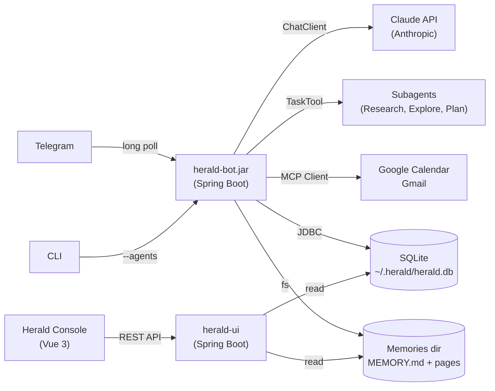
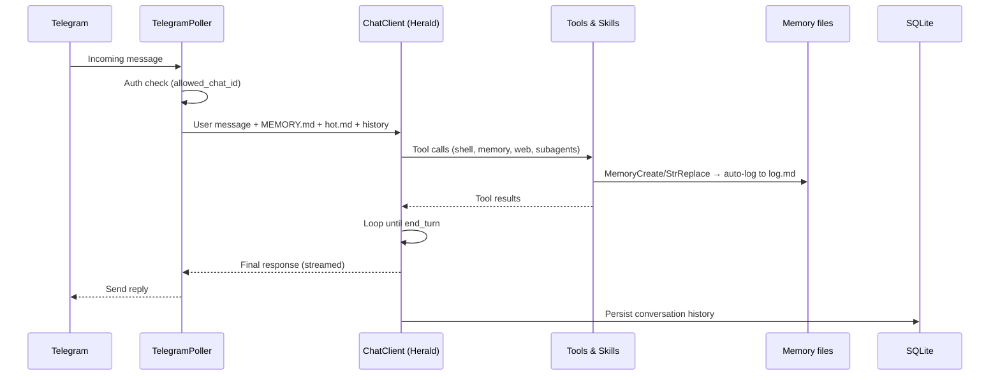
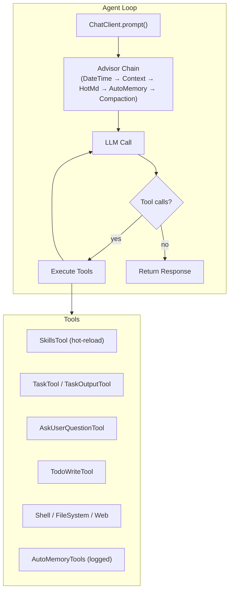
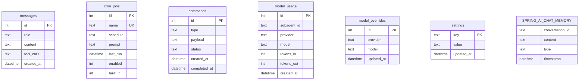

<p align="center">
  
</p>

# Herald

**A hackable AI agent that works two ways — a Telegram-native personal assistant that learns over time, or a single-shot task runner that exits when it's done.** Same JAR, same agent loop, same tool system. What changes is what you plug in.

> Need the "why bother" pitch first? → [**Why Run Herald**](docs/why-herald.md)


---

## What can Herald do?

Real interactions, not abstractions:

```
You:     "What did that Karpathy gist about LLM wikis say?"
Herald:  Runs wiki-query → grep /sources/, loads 2 pages, answers with
         citations: "see [sources/karpathy-wiki](sources/karpathy-wiki.md)"

You:     "Ingest this into memory: https://blog.example.com/post"
Herald:  Runs wiki-ingest → fetches the URL, creates sources/post.md
         with takeaways, updates related concepts/ and entities/ pages,
         logs the event to log.md

You:     "Brief me on my week"
Herald:  (scheduled at 07:00 Mon) — pulls Gmail, Calendar, pending
         GitHub PRs, synthesizes via the research subagent, sends you
         a single message

You:     /save phase-e-shipped
Herald:  Files the current conversation into long-term memory as a
         wiki note — concepts, entities, takeaways, all cross-linked

$ java -jar herald-bot.jar --agents=cf-analyzer.md \
    --prompt="analyze this Cloud Foundry manifest and flag risks"
# Exits with the analysis. No DB, no Telegram, no daemon.
```

## Herald Console

Browse long-term memory grouped by type, edit skills with live reload, and manage cron jobs — all from a Vue 3 web UI.

| System Status | Skills Editor |
|:---:|:---:|
|  |  |

| Memory Viewer | Settings |
|:---:|:---:|
|  |  |

## Table of Contents

- [Why Herald](#why-herald)
- [Quick Start](#quick-start)
- [Features](#features)
- [The Memory System](#the-memory-system)
- [Skills](#skills)
- [Telegram Commands](#telegram-commands)
- [Architecture](#architecture)
- [Getting Started](#getting-started)
- [Environment Variables](#environment-variables)
- [Task Agent Mode](#task-agent-mode)
- [Agentic Patterns — Spring AI Agent Utils](#agentic-patterns--spring-ai-agent-utils)
- [Project Structure](#project-structure)
- [Technology Stack](#technology-stack)
- [Contributing](#contributing)
- [License](#license)

## Why Herald

Most agent projects pick one personality: "chatty assistant" **or** "scripted task runner." Herald runs both off the same codebase because the split is just configuration, not architecture:

- **Personal assistant** — Telegram bot token + database path. Runs 24/7, builds long-term memory of who you are via typed Markdown files, manages Gmail and Calendar, delegates deep research to specialist subagents, runs on cron.
- **Task agent** — `--agents=my-agent.md`. One-shot or REPL, zero persistence, exits when done. The agent file defines the personality, tools, and model.
- **Hybrid** — turn either dial up or down. Keep the DB but drop Telegram. Add Telegram to a task agent for notifications. Pick what you need, skip what you don't.

The reference implementation of [Spring AI's Agentic Patterns](https://spring.io/blog/2026/01/13/spring-ai-generic-agent-skills/) series, adapted for personal use.

## Quick Start

**Task agent in 60 seconds** — no Telegram, no database required:

```bash
# 1. Build
git clone https://github.com/dbbaskette/herald.git && cd herald
./mvnw package -DskipTests

# 2. Create a minimal agent
cat > hello-agent.md << 'EOF'
---
name: hello-agent
description: A friendly assistant with filesystem access
model: sonnet
tools: [filesystem]
---

You are a helpful assistant with access to the local filesystem.
EOF

# 3. Run it
export ANTHROPIC_API_KEY=sk-ant-...
java -jar herald-bot/target/herald-bot-*.jar --agents=hello-agent.md \
    --prompt="What's in the current directory?"
```

For the full personal-assistant experience with Telegram + memory, jump to [Getting Started](#getting-started).

> **New to Herald?** The [Getting Started 101 guide](docs/getting-started-101.md) walks you from zero to a running task agent in about ten minutes with no Spring/Java prerequisites.

## Features

**Chat surfaces**
- 🗨️ **Telegram-native** — chat where you already message; streaming replies, inline keyboards for agent-asked questions
- 💻 **Management console** — Vue 3 web UI for memory browsing, skills editing, cron jobs, live status via SSE
- ⌨️ **CLI task mode** — `--agents=file.md --prompt="..."` for one-shot execution, or drop the `--prompt` for a REPL

**Compounding long-term memory** (see [The Memory System](#the-memory-system))
- 📁 File-based memory with a typed taxonomy (`user`, `feedback`, `project`, `reference`, `concept`, `entity`, `source`)
- 🗂️ `MEMORY.md` is a grouped catalog — not a flat dump
- 📓 Append-only `log.md` records every memory mutation with timestamps
- 🔥 `hot.md` session-continuity note, auto-refreshed from compaction summaries
- 🔍 `wiki-ingest` / `wiki-query` / `wiki-lint` skills for write, read-with-citations, and health checks
- 📒 Opt-in Obsidian vault mode for `[[wikilinks]]` + Graph view; default stays portable

**Capabilities**
- 🧩 **Skills** — hot-reloaded Markdown files in `skills/` ([Agent Skills — Part 1](https://spring.io/blog/2026/01/13/spring-ai-generic-agent-skills/))
- 🕵️ **Subagents** — TaskTool delegation for Explore, Plan, Research, Bash ([Part 4](https://spring.io/blog/2026/01/27/spring-ai-agentic-patterns-4-task-subagents))
- 🌐 **A2A protocol** — delegate to remote agents alongside local ones ([Part 5](https://spring.io/blog/2026/01/29/spring-ai-agentic-patterns-a2a-integration))
- ❓ **Clarify-before-act** — `AskUserQuestionTool` with Telegram inline-keyboard integration ([Part 2](https://spring.io/blog/2026/01/16/spring-ai-ask-user-question-tool))
- ✅ **Structured task tracking** — `TodoWriteTool` with per-step progress messages ([Part 3](https://spring.io/blog/2026/01/20/spring-ai-agentic-patterns-3-todowrite))
- ⏰ **Proactive scheduling** — morning briefings, reminders, cron-driven outreach
- 📧 **Google Workspace** — Gmail and Calendar via the `gws` CLI
- 🐚 **Shell & file access** — with regex-blocked destructive commands, sensitive-value redaction, and confirmation gating

**Models**
- 🤖 **Multi-provider** — Anthropic, OpenAI, Gemini, Ollama (local), LM Studio (local). Switch at runtime with `/model`
- 💰 **Tiered routing** — Haiku / Sonnet / Opus tiers for subagents so cheap work stays cheap

## The Memory System

Herald implements the compounding-knowledge pattern from [Karpathy's LLM Wiki gist](https://gist.github.com/karpathy/442a6bf555914893e9891c11519de94f) — memory that gets *more valuable* over time instead of turning into a scratchpad. Everything is plain Markdown on disk. No database, no lock-in.

```
$HERALD_MEMORIES_DIR/           # default ~/.herald/memories
├── MEMORY.md                   # catalog, grouped by type
├── log.md                      # append-only event log
├── hot.md                      # session-continuity cache
├── user_profile.md             # type: user
├── feedback_testing.md         # type: feedback
├── concepts/                   # type: concept (subdir convention)
│   └── hot_path.md
├── entities/                   # type: entity
│   └── jamie.md
└── sources/                    # type: source
    └── karpathy_wiki.md
```

**How pages get in:**
- **Automatically** — the agent calls `MemoryCreate` / `MemoryStrReplace` when it learns something worth keeping (user preferences, project decisions, non-obvious feedback). Every successful mutation auto-logs to `log.md`.
- **On demand** — `/save [name]` files the current conversation into memory via the `wiki-ingest` skill: extracts concepts/entities/takeaways, creates the right pages, updates the index.
- **Research auto-save** — the research subagent asks once after each synthesis whether to file the findings (URLs preserved for later citation).

**How pages get used:**
- **Every turn** — `MEMORY.md` is injected into the system prompt so the agent always sees the catalog. `hot.md` adds a short session-continuity summary.
- **On demand** — `wiki-query` skill greps the memories dir, loads top-ranked pages, answers with explicit page citations instead of training-data fabrication.
- **Health checks** — `wiki-lint` skill finds orphan pages, dead wikilinks, index mismatches, and (optionally, LLM-assisted) stale/contradicting claims. Emits a report; never mutates without confirmation. Cron-runnable.

**Obsidian vault mode** — opt-in via `HERALD_OBSIDIAN_VAULT_MODE=auto|on|off`. Point `HERALD_MEMORIES_DIR` at an Obsidian vault folder and new pages use `[[wikilinks]]` for Graph view + backlinks. Default stays `plain-markdown` so notes render correctly in GitHub, VS Code, and `cat`. Optional CSS and Bases-dashboard snippets under `assets/obsidian-snippets/` — copy in if you want, ignore otherwise.

## Skills

Skills are Markdown files with YAML front matter that teach Herald new capabilities without code changes. Drop a file into `skills/` and Herald picks it up immediately — no restart required.

```
skills/
├── wiki-ingest/       # Ingest URL/file/text → sources + concepts + entities
├── wiki-query/        # Search memory, answer with page citations
├── wiki-lint/         # Orphan/dead-link/stale-claim audit
├── skill-creator/     # Meta — create and iterate on skills
├── github/            # GitHub PR review and workflow helpers
├── gmail/             # Email composition and search (via gws CLI)
├── google-calendar/   # Calendar management (via gws CLI)
├── google-drive/      # Drive file operations (via gws CLI)
├── obsidian/          # Obsidian vault search (via obsidian CLI)
├── weather/           # Weather lookups (wttr.in)
└── broadcom/          # VMware / Broadcom knowledge base
```

Each skill follows this format:

```markdown
---
name: skill-name
description: When to use this skill (shown to the LLM for selection)
---

Instructions, shell recipes, examples, and guardrails.
```

Herald's `ReloadableSkillsTool` wraps the upstream `SkillsTool` with a `WatchService`-based filesystem watcher (`SkillsWatcher`) that triggers a 250ms debounced reload on any file change. The Herald Console also provides a web-based skills editor with live reload status via SSE.

## Telegram Commands

| Command | What it does |
|---------|-------------|
| `/help` | Show all available commands |
| `/status` | System status: uptime, model, active tools |
| `/save [name]` | File the current conversation into long-term memory |
| `/memory` | Pointer — memory is managed by the agent via long-term memory files |
| `/debug` | Context size, memory count, tools count |
| `/reset` | Clear conversation history (long-term memory preserved) |
| `/model status` | Show current provider and model + daily token usage |
| `/model <provider> <model>` | Switch model at runtime |
| `/skills list` | Show all loaded skills |
| `/skills reload` | Force reload skills from disk |
| `/cron list` | List all cron jobs with schedules |
| `/cron enable <name>` | Enable a cron job |
| `/cron disable <name>` | Disable a cron job |
| `/cron edit <name> schedule <expr>` | Update a cron schedule |
| `/confirm <id> yes\|no` | Approve or deny a pending action |

## Architecture



Herald is a modular Spring Boot monorepo. One JAR (`herald-bot.jar`) does everything — what it does depends on what you configure:

| Module | Role | Depends on |
|--------|------|------------|
| **herald-core** | Agentic loop, advisors, tools, AgentFactory, CLI runner | Spring AI |
| **herald-persistence** | SQLite, memory advisors, cron, compaction | herald-core + JDBC |
| **herald-telegram** | Telegram transport, commands, question handler | herald-core + herald-persistence |
| **herald-bot** | Thin wiring — assembles all modules into one executable | All modules |
| **herald-ui** | Management console (REST API + Vue 3) | herald-persistence |

| Configuration | What Herald becomes |
|---------------|-------------------|
| `bot-token` + `db-path` | Personal assistant (Telegram + memory + cron) |
| `db-path` only | Persistent agent without Telegram (REST API) |
| `--agents=file.md` | Task agent (one-shot or REPL, no persistence) |
| `--agents=file.md --prompt="..."` | Single-prompt execution, exits when done |

### Data Flow



## Getting Started

This guide walks you through setting up the full Telegram + memory + cron experience.

> **Brand new to Herald?** Start with the [Getting Started 101 guide](docs/getting-started-101.md) — task agent in ten minutes, no Telegram, no DB, no Spring/Java experience required.

### Prerequisites

| Requirement | Version | Check |
|-------------|---------|-------|
| **macOS** | Any recent | — |
| **Java JDK** | 21+ | `java -version` |
| **Maven** | 3.9+ (wrapper included) | `./mvnw -version` |
| **Node.js** | 20+ | `node -v` |
| **npm** | 10+ | `npm -v` |

You will also need:

- **Anthropic API key** — [console.anthropic.com](https://console.anthropic.com)
- **Telegram bot token** — via [@BotFather](https://t.me/BotFather)

### Step 1 — Create a Telegram bot

1. Open Telegram and message [@BotFather](https://t.me/BotFather)
2. Send `/newbot` and follow the prompts
3. Copy the **bot token** BotFather gives you
4. Message your new bot, then visit `https://api.telegram.org/bot<YOUR_TOKEN>/getUpdates` to find your **chat ID** in the response JSON

### Step 2 — Clone and build

```bash
git clone https://github.com/dbbaskette/herald.git
cd herald
./mvnw package -DskipTests
```

Builds all modules: `herald-core`, `herald-persistence`, `herald-telegram`, `herald-bot`, `herald-ui`.

### Step 3 — Configure

```bash
cp .env.example .env
```

Fill in the three required values:

```bash
ANTHROPIC_API_KEY=sk-ant-...
HERALD_TELEGRAM_BOT_TOKEN=123456:ABC-DEF...
HERALD_TELEGRAM_ALLOWED_CHAT_ID=your-chat-id
```

`.env.example` documents all optional variables. `.env` is gitignored.

### Step 4 — Run

```bash
./run.sh          # starts both bot + ui (default)
./run.sh bot      # bot only (port 8081)
./run.sh ui       # ui only (port 8080)
./run.sh stop     # stops all services
./run.sh build    # builds all modules
```

Send your bot a message on Telegram — you should get a response from Claude.

**Sanity checks:**

- `/status` — shows uptime, active model, active tools
- `/help` — lists every command
- "What can you do?" — free-text message gets a normal agent reply

### Step 5 — Install as a macOS service (optional)

To run 24/7 as a background `launchd` agent:

```bash
make check-env   # verify required env vars
make install     # build, install, start the service
```

Manage it with:

```bash
make start | stop | restart | logs | uninstall
```

Logs land in `~/Library/Logs/herald.log`.

### Step 6 — Start the console (optional)

```bash
cd herald-ui/frontend && npm install && npm run build && cd ../..
./mvnw -pl herald-ui spring-boot:run
```

Then open [http://localhost:8080](http://localhost:8080).

### Step 7 — Google Workspace (optional)

Herald supports Gmail and Google Calendar via the `gws` CLI. See [docs/gws-setup.md](docs/gws-setup.md).

## Environment Variables

| Variable | Description | Required | Default |
|----------|-------------|----------|---------|
| `ANTHROPIC_API_KEY` | Anthropic API key | Yes | — |
| `HERALD_TELEGRAM_BOT_TOKEN` | Bot token from @BotFather | Yes | — |
| `HERALD_TELEGRAM_ALLOWED_CHAT_ID` | Your Telegram chat ID | Yes | — |
| `OPENAI_API_KEY` | OpenAI API key | No | — |
| `GEMINI_API_KEY` | Google Gemini API key | No | — |
| `OLLAMA_BASE_URL` | Ollama server URL | No | — |
| `HERALD_DEFAULT_PROVIDER` | Boot-time provider (`anthropic`, `openai`, `ollama`, `gemini`) | No | `anthropic` |
| `HERALD_MODEL_DEFAULT` | Main agent model | No | `claude-sonnet-4-5` |
| `HERALD_MODEL_HAIKU` | Fast/cheap subagent tier | No | `claude-haiku-4-5` |
| `HERALD_MODEL_SONNET` | Mid-tier subagent | No | `claude-sonnet-4-5` |
| `HERALD_MODEL_OPUS` | High-capability subagent tier | No | `claude-opus-4-5` |
| `HERALD_MODEL_OPENAI` | OpenAI subagent tier | No | `gpt-4o` |
| `HERALD_MODEL_OLLAMA` | Ollama (local) subagent tier | No | `llama3.2` |
| `HERALD_MODEL_GEMINI` | Gemini subagent tier | No | `gemini-2.5-flash` |
| `GOOGLE_WORKSPACE_CLI_CLIENT_ID` | OAuth client ID for Gmail/Calendar | No | — |
| `GOOGLE_WORKSPACE_CLI_CLIENT_SECRET` | OAuth client secret | No | — |
| `HERALD_WEB_SEARCH_API_KEY` | Brave Search API key | No | — |
| `HERALD_CRON_TIMEZONE` | Timezone for cron scheduler | No | `America/New_York` |
| `HERALD_AGENT_PERSONA` | Override agent persona | No | Built-in default |
| `HERALD_AGENT_CONTEXT_FILE` | Path to standing brief | No | `~/.herald/CONTEXT.md` |
| `HERALD_WEATHER_LOCATION` | Location for weather tool | No | — |
| `HERALD_AGENT_MAX_CONTEXT_TOKENS` | Token limit before context compaction | No | `200000` |
| `HERALD_MEMORIES_DIR` | Long-term memory directory (can be an Obsidian vault folder) | No | `~/.herald/memories` |
| `HERALD_OBSIDIAN_VAULT_PATH` | Obsidian vault path for vault-aware tools/skills | No | — |
| `HERALD_OBSIDIAN_VAULT_MODE` | Link style for new memory pages: `auto` / `on` / `off` | No | `auto` |
| `HERALD_CONFIG` | Override config file path | No | `~/.herald/herald.yaml` |

## Task Agent Mode

Pass `--agents=` to the same `herald-bot.jar` and it becomes a task agent. No Telegram, no database, no long-running process. The `agents.md` file defines everything: personality, tools, model.

### Quickstart

1. **Create an agent definition** (`my-agent.md`):
   ```yaml
   ---
   name: my-agent
   description: A helpful assistant
   model: sonnet
   tools: [filesystem, web]
   ---

   You are a helpful assistant with access to the filesystem and web.
   ```

2. **Set your API key:**
   ```bash
   export ANTHROPIC_API_KEY=sk-...
   ```

3. **Run it:**
   ```bash
   # Single prompt — runs the task, prints the result, exits
   java -jar herald-bot.jar --agents=my-agent.md --prompt="List files in /tmp"

   # Interactive REPL — type prompts, get responses, Ctrl+D to exit
   java -jar herald-bot.jar --agents=my-agent.md
   ```

The only required env var is `ANTHROPIC_API_KEY` (or the key for whichever provider your agent uses). Everything else activates based on what config is present:

| What you set | What Herald does |
|-------------|-----------------|
| Nothing extra | Task agent — in-memory conversation, console I/O |
| `herald.memory.db-path` | Adds persistent memory and cron |
| `herald.telegram.bot-token` | Adds Telegram transport |
| Both | Full personal assistant mode |

See [`examples/`](examples/) for ready-to-use agent definitions (`cf-analyzer.md`, `code-reviewer.md`, `csv-reporter.md`, `report-writer.md`) and [`docs/agents-md-spec.md`](docs/agents-md-spec.md) for the full format.

## Agentic Patterns — Spring AI Agent Utils

Herald is a reference implementation of the architectural patterns in the [Spring AI Agentic Patterns](https://spring.io/blog/2026/01/13/spring-ai-generic-agent-skills/) blog series by Christian Tzolov. The series documents the [spring-ai-agent-utils](https://github.com/spring-ai-community/spring-ai-agent-utils) toolkit — composable building blocks for AI agents, inspired by Claude Code's architecture. Herald adopts all seven patterns, adapting each for a Telegram-native, always-on personal assistant.

### Blog Series

1. **Part 1**: [Agent Skills — Modular, Reusable Capabilities](https://spring.io/blog/2026/01/13/spring-ai-generic-agent-skills/)
2. **Part 2**: [AskUserQuestionTool — Agents That Clarify Before Acting](https://spring.io/blog/2026/01/16/spring-ai-ask-user-question-tool/)
3. **Part 3**: [TodoWriteTool — Why Your AI Agent Forgets Tasks](https://spring.io/blog/2026/01/20/spring-ai-agentic-patterns-3-todowrite/)
4. **Part 4**: [Subagent Orchestration — Hierarchical Agent Architectures](https://spring.io/blog/2026/01/27/spring-ai-agentic-patterns-4-task-subagents/)
5. **Part 5**: [A2A Protocol — Building Interoperable Agents](https://spring.io/blog/2026/01/29/spring-ai-agentic-patterns-a2a-integration/)
6. **Part 6**: [AutoMemoryTools — Persistent Agent Memory Across Sessions](https://spring.io/blog/2026/04/07/spring-ai-agentic-patterns-6-memory-tools/)
7. **Part 7**: [Session API — Event-Sourced Short-Term Memory with Context Compaction](https://spring.io/blog/2026/04/15/spring-ai-session-management/)

> **Deep dive:** See [docs/herald-patterns-comparison.md](docs/herald-patterns-comparison.md) for a feature-by-feature comparison of every blog pattern against Herald's implementation.

### The Pattern

Truly agentic behavior emerges from composition — not a single monolithic prompt, but a set of small, focused tools and advisors the LLM orchestrates through its tool-calling loop:



### Pattern Coverage

| Pattern | Blog Post | Status | Herald Implementation |
|---------|-----------|--------|----------------------|
| **Agent Skills** | [Part 1](https://spring.io/blog/2026/01/13/spring-ai-generic-agent-skills/) | ✅ ↗ | `ReloadableSkillsTool` wraps upstream `SkillsTool` with a `WatchService`-based hot-reload (`SkillsWatcher`, 250ms debounce). Skills live in `skills/` as Markdown + YAML front matter. |
| **AskUserQuestion** | [Part 2](https://spring.io/blog/2026/01/16/spring-ai-ask-user-question-tool/) | ✅ | Upstream `AskUserQuestionTool` with `TelegramQuestionHandler` implementing `QuestionHandler`. Single-select options render as inline keyboard buttons; multi-select and free-text fall back to text messaging. Blocks on `CompletableFuture` with a 5-minute timeout. |
| **TodoWrite** | [Part 3](https://spring.io/blog/2026/01/20/spring-ai-agentic-patterns-3-todowrite/) | ✅ | Upstream `TodoWriteTool` with `pending → in_progress → completed` states. A `todoEventHandler` dispatches formatted progress to `MessageSender` (Telegram) with status symbols, or prints to stdout when no transport is configured. |
| **Subagent Orchestration** | [Part 4](https://spring.io/blog/2026/01/27/spring-ai-agentic-patterns-4-task-subagents/) | ✅ | `TaskTool` + `TaskOutputTool` with multi-model tier routing. Uses all four built-in subagents (Explore, General-Purpose, Plan, Bash) plus a custom **research** agent (Opus, deep analysis + web search) in `.claude/agents/`. |
| **A2A Protocol** | [Part 5](https://spring.io/blog/2026/01/29/spring-ai-agentic-patterns-a2a-integration/) | ✅ | Remote A2A agents configured under `herald.a2a.agents`; each entry is registered as a `SubagentReference` alongside local subagents and dispatched via the same `TaskTool`. Resolution is lazy — `AgentCard` fetched on first delegation. |
| **AutoMemoryTools** | [Part 6](https://spring.io/blog/2026/04/07/spring-ai-agentic-patterns-6-memory-tools/) | ✅ ↗ | Herald-owned `HeraldAutoMemoryAdvisor` replaces the upstream advisor and decorates each mutating `ToolCallback` so successful ops append to `log.md`. Extended taxonomy (`concept`, `entity`, `source`) beyond the blog's four types. `MEMORY.md` is a type-grouped catalog. Sibling `wiki-ingest` / `wiki-query` / `wiki-lint` skills close the compounding-knowledge loop. Optional `obsidian-vault` mode switches new pages to `[[wikilinks]]`. |
| **Session API** | [Part 7](https://spring.io/blog/2026/04/15/spring-ai-session-management/) | ⏳ | Targets Spring AI 2.1 (Nov 2026). Today Herald uses `OneShotMemoryAdvisor` + `ContextCompactionAdvisor` over `ChatMemory`/`MessageWindowChatMemory` — functionally similar (windowed history + auto-compaction) but lacks turn-safe boundaries, pluggable compaction strategies, and `conversation_search`. Migration tracked in the comparison doc. |

**Legend:** ✅ Adopted — ↗ Herald extension beyond upstream — ⏳ Planned

### Herald-Specific Extensions

Beyond the seven blog patterns, Herald adds capabilities specific to an always-on personal assistant:

| Extension | Description |
|-----------|-------------|
| **Advisor chain** | Layered `CallAdvisor` pipeline: `DateTimePromptAdvisor` → `ContextMdAdvisor` (standing brief from `~/.herald/CONTEXT.md`) → `HotMdAdvisor` (session-continuity note) → `HeraldAutoMemoryAdvisor` (memory tools + MEMORY.md) → `ContextCompactionAdvisor` (compacts near token limits; writes summary to `log.md` + refreshes `hot.md`) → `OneShotMemoryAdvisor` (conversation history) |
| **Compounding wiki skills** | `wiki-ingest` / `wiki-query` / `wiki-lint` turn the memories dir into a first-class knowledge base — ingest URLs/files/conversations, answer with citations, audit for orphans/staleness |
| **/save command** | Files the current Telegram conversation into long-term memory as a wiki note, with slug hint support |
| **Proactive scheduling** | `CronService` runs agent prompts on schedules — briefings, reminders, outreach with no user input |
| **Shell security** | `HeraldShellDecorator` with regex blocklist, Telegram confirmation gate for `sudo`/system writes, sensitive-value redaction, configurable timeouts |
| **Runtime model switching** | `/model` command switches between Anthropic, OpenAI, Ollama, Gemini, LM Studio at runtime; persisted in the `settings` table |
| **Management console** | Vue 3 web UI for skills editing, file-based memory browsing grouped by type, cron jobs, conversation history, live status via SSE |
| **Google Workspace** | Gmail and Calendar via `gws` CLI |
| **Multi-tier model routing** | Haiku / Sonnet / Opus tiers configured per subagent type so cheap work uses cheap models |

### Tool Registration Architecture

Herald separates tools into two categories matching how Spring AI handles them:

- **`@Tool`-annotated POJOs** (via `.defaultTools()`) — `HeraldShellDecorator`, `FileSystemTools`, `WebTools`, `AskUserQuestionTool` (upstream), `TodoWriteTool` (upstream), `CronTools`, `GwsTools`, `TelegramSendTool`
- **Raw `ToolCallback` objects** (via `.defaultToolCallbacks()`) — `TaskTool`, `TaskOutputTool`, `ReloadableSkillsTool`, and the logging-decorated memory callbacks from `HeraldAutoMemoryAdvisor`

## A2A Agents (remote subagents)

Herald can delegate to remote A2A-compliant agents alongside its local subagents. Declare each remote agent under `herald.a2a.agents` in `herald.yaml`:

```yaml
herald:
  a2a:
    agents:
      - name: airbnb-agent
        url: http://localhost:10001/airbnb
        metadata:
          authorization: "Bearer some-token"
      - name: weather-agent
        url: http://localhost:10002/weather
```

- `name` is a local label used in startup logs. The real display name comes from the resolved `AgentCard`.
- `metadata` is an optional map passed verbatim to the underlying `SubagentReference`.
- Resolution is **lazy** — Herald does not fetch `/.well-known/agent-card.json` at startup. A misconfigured or unreachable URL surfaces only on the first delegation to that agent.

## Project Structure

```
herald/
├── pom.xml                          # Parent POM — Spring AI BOM, 5 modules
├── Makefile                         # Build, install, service management
├── herald-core/                     # Agentic loop foundation (zero persistence deps)
│   └── src/main/java/com/herald/
│       ├── agent/                   # AgentFactory, AgentService, advisors, ModelSwitcher
│       │   ├── profile/             # AgentProfile record, AgentProfileParser
│       │   └── subagent/            # HeraldSubagentReferences
│       ├── tools/                   # FileSystemTools, WebTools, ShellSecurityConfig
│       └── config/                  # HeraldConfig, ModelProviderConfig
├── herald-persistence/              # SQLite, memory advisors, cron
│   └── src/main/java/com/herald/
│       ├── agent/                   # HeraldAutoMemoryAdvisor, ContextCompactionAdvisor,
│       │                            #   MemoryLogWriter, LoggingMemoryToolCallback
│       ├── cron/                    # CronService, CronTools, BriefingJob
│       ├── tools/                   # HeraldShellDecorator, GwsTools
│       └── config/                  # DataSourceConfig, JsonChatMemoryRepository
├── herald-telegram/                 # Telegram transport
│   └── src/main/java/com/herald/
│       ├── telegram/                # Poller, sender, CommandHandler, question handler
│       └── tools/                   # TelegramSendTool
├── herald-bot/                      # Thin wiring module — the executable JAR
│   └── src/main/java/com/herald/
│       ├── HeraldApplication.java   # Spring Boot entry point
│       ├── agent/                   # HeraldAgentConfig (wiring)
│       └── api/                     # ChatController, ModelController
├── herald-ui/                       # Management console
│   ├── src/main/java/com/herald/ui/ # REST controllers, FileMemoryController, SSE
│   └── frontend/                    # Vue 3 + Vite + Tailwind
├── examples/                        # Example agents.md files
├── skills/                          # Reloadable skill definitions (see above)
├── assets/
│   ├── screenshots/                 # Console screenshots
│   └── obsidian-snippets/           # Optional CSS + Bases dashboard (vault-mode only)
├── .claude/agents/                  # Custom subagent definitions (research)
└── docs/
    ├── getting-started-101.md       # Ten-minute task-agent walkthrough
    ├── agents-md-spec.md            # agents.md format specification
    ├── herald-patterns-comparison.md
    └── gws-setup.md
```

## Technology Stack

| Component | Technology |
|-----------|------------|
| Language | Java 21 (virtual threads) |
| Framework | Spring Boot 4.0.x |
| AI Framework | Spring AI 2.0.0-SNAPSHOT |
| Agent Utils | spring-ai-agent-utils |
| Telegram | pengrad/java-telegram-bot-api |
| Database | SQLite (WAL mode) |
| Console Frontend | Vue 3 + Vite + Tailwind CSS |
| Console Backend | Spring MVC + SSE |
| Process Management | macOS launchd |

### Database Schema



## Contributing

Contributions welcome! To get started:

1. Fork the repository
2. Create a feature branch (`git checkout -b feature/amazing-feature`)
3. Commit your changes (`git commit -m 'Add amazing feature'`)
4. Push to the branch (`git push origin feature/amazing-feature`)
5. Open a Pull Request

Before submitting, please run `./mvnw verify` and make sure the test suite is green.

## License

Distributed under the MIT License. See [LICENSE](LICENSE) for details.
