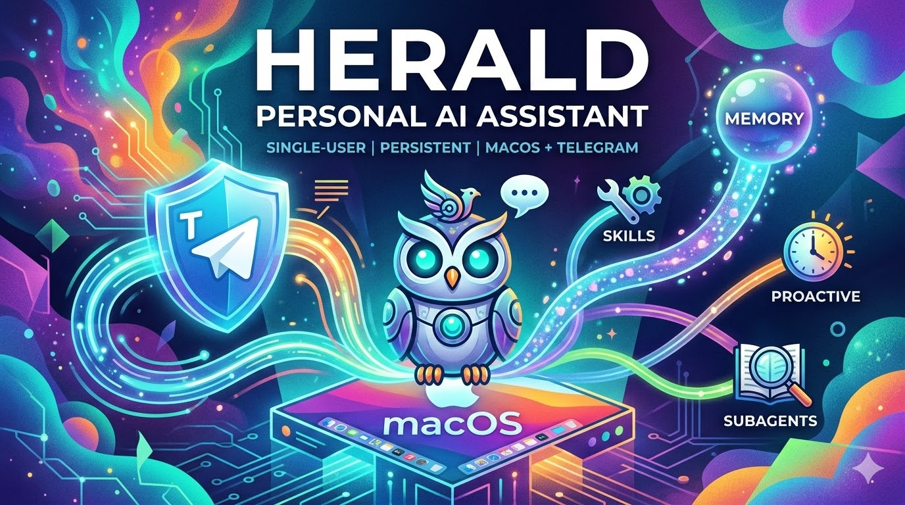
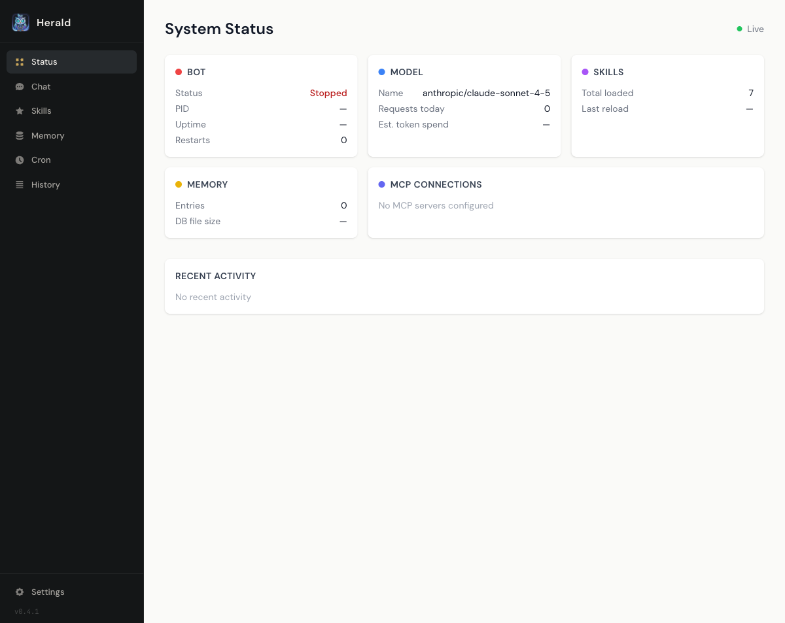
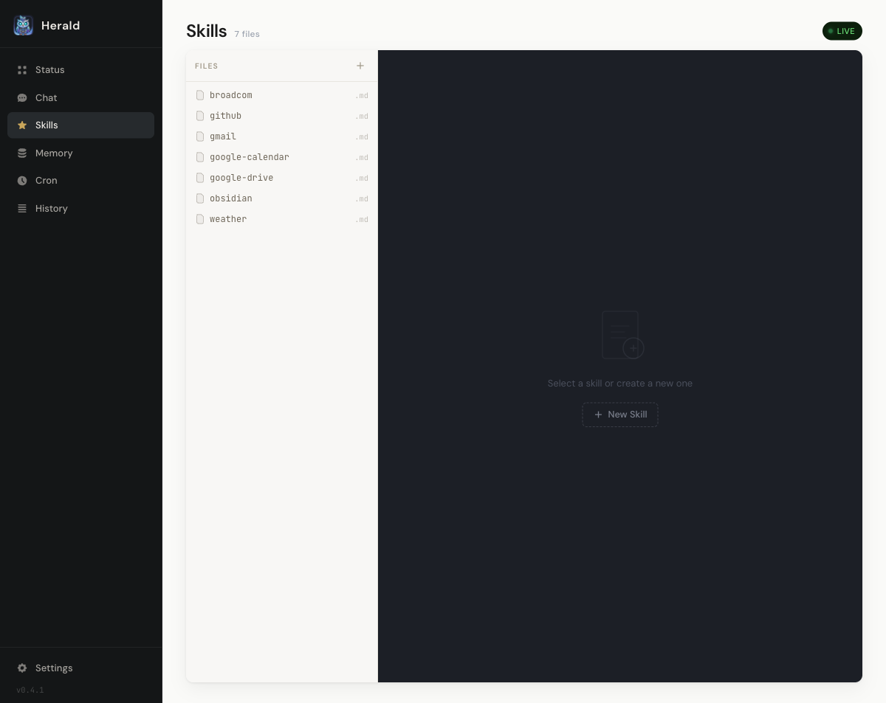
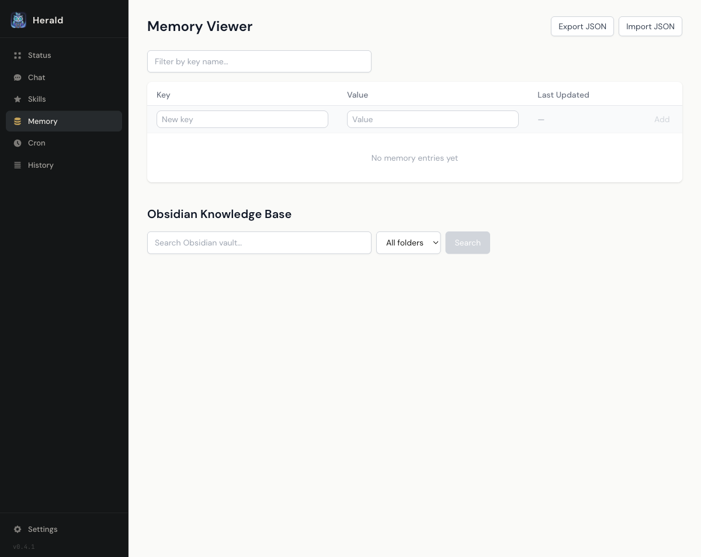
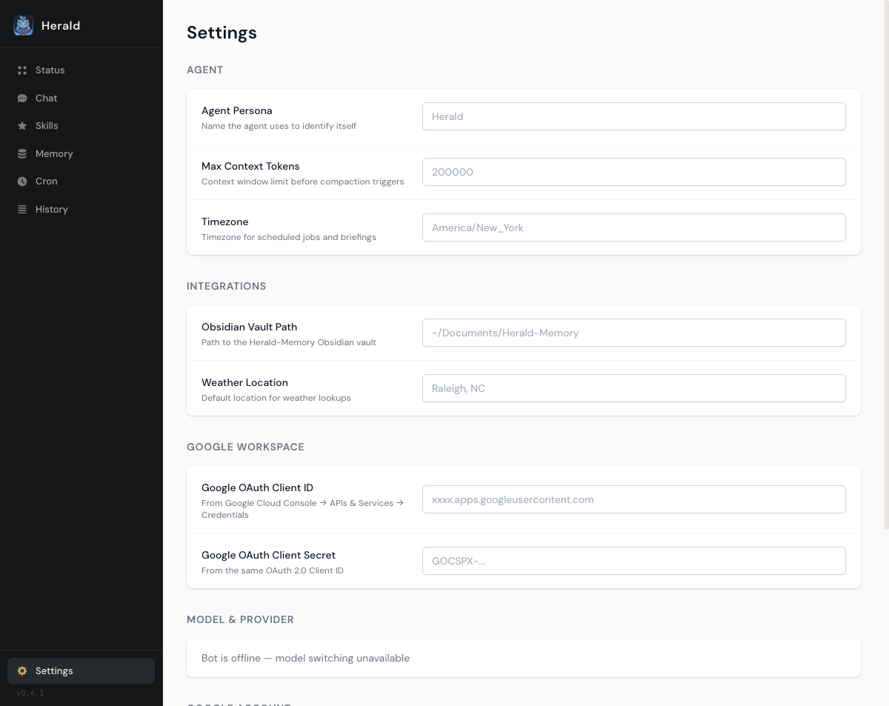
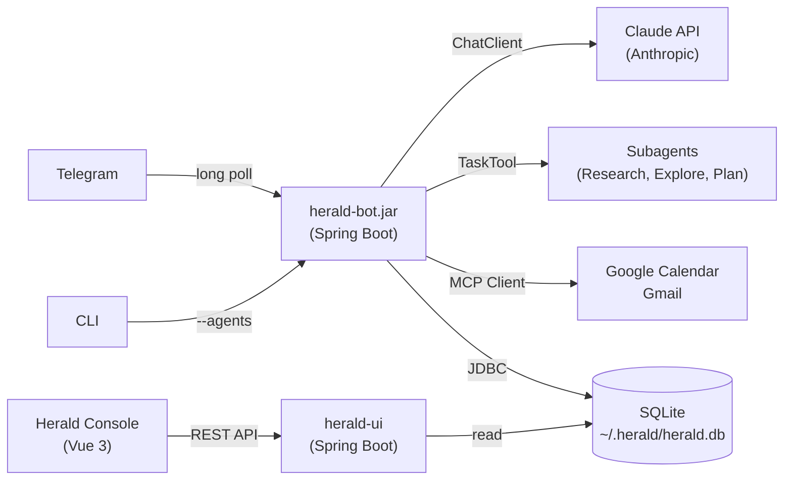
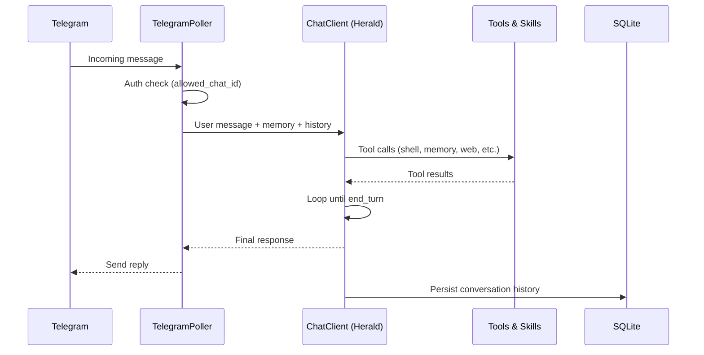
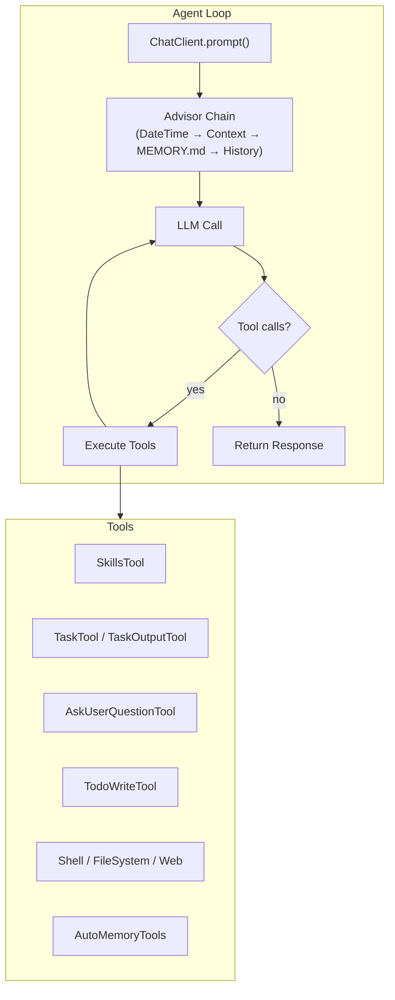
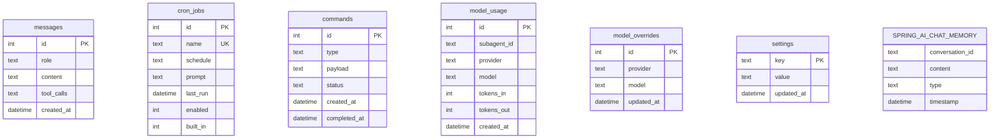

<p align="center">
  
</p>

# Herald

**One JAR, two personalities.** Configure it as an always-on personal assistant with Telegram and persistent memory, or point it at an `agents.md` file and use it as a single-shot task agent. Same engine, different mission.


## Table of Contents

- [About](#about)
- [Features](#features)
- [Skills](#skills)
- [Architecture](#architecture)
- [Data Flow](#data-flow)
- [Getting Started](#getting-started)
- [Environment Variables](#environment-variables)
- [Task Agent Mode](#task-agent-mode)
- [Telegram Commands](#telegram-commands)
- [Project Structure](#project-structure)
- [Agentic Patterns](#agentic-patterns--spring-ai-agent-utils)
- [Technology Stack](#technology-stack)
- [Database Schema](#database-schema)
- [Build Phases](#build-phases)
- [Contributing](#contributing)
- [License](#license)

## About

Herald is one app that becomes two different agents depending on how you configure it.

**Personal assistant mode** — set a Telegram bot token and a database path, and Herald becomes an always-on AI assistant that runs 24/7 on your Mac. It connects through Telegram, builds long-term memory of who you are via typed Markdown files, manages your calendar and email, runs scheduled briefings, and delegates complex research to specialized subagents.

**Task agent mode** — pass `--agents=my-agent.md` and Herald becomes a focused task agent. An `agents.md` file defines the agent's personality, tools, and model in a single file. Give it a prompt, get a result, done. No database, no Telegram, no long-running process.

```bash
# Personal assistant — always-on with Telegram and memory
./run.sh bot

# Task agent — one-shot execution from agents.md
java -jar herald-bot.jar --agents=cf-agent.md --prompt="List all CF spaces"

# Task agent — interactive REPL
java -jar herald-bot.jar --agents=code-reviewer.md
```

The personality switch is just configuration. The same JAR, the same advisor chain, the same tool system, the same multi-provider model routing. What changes is what you plug in.

## Features

- **Telegram-native** — chat with your AI assistant where you already message
- **Long-term memory** — file-based persistent memory via [AutoMemoryTools](https://spring.io/blog/2026/04/07/spring-ai-agentic-patterns-6-memory-tools) with typed Markdown files and MEMORY.md index
- **Skills system** — extensible via Markdown files in `skills/` directory
- **Subagent delegation** — routes complex research to specialist agents via TaskTool
- **Proactive scheduling** — morning briefings, reminders, and cron-driven outreach
- **Shell & file access** — executes commands on your Mac with security guardrails
- **Google Workspace** — Gmail and Google Calendar via `gws` CLI
- **Multi-provider** — Anthropic, OpenAI, Ollama, and Gemini models, switchable at runtime
- **Configurable memory storage** — memories directory is configurable, can point to an Obsidian vault for browsable/searchable notes
- **Management console** — Vue 3 web UI for skills editing, memory, cron, and status

### Herald Console

| System Status | Skills Editor |
|:---:|:---:|
|  |  |

| Memory Viewer | Settings |
|:---:|:---:|
|  |  |

## Skills

Skills are Markdown files with YAML front matter that teach Herald new capabilities without code changes. Drop a file into `skills/` and Herald picks it up immediately — no restart required.

```
skills/
├── broadcom/SKILL.md        # VMware/Broadcom knowledge base
├── github/SKILL.md          # GitHub workflow automation
├── gmail/SKILL.md           # Email composition & search
├── google-calendar/SKILL.md # Calendar management
├── google-drive/SKILL.md    # Drive file operations
└── weather/SKILL.md         # Weather lookups
```

Each skill file follows this format:

```markdown
---
name: skill-name
description: What this skill does (shown to the LLM for selection)
---

Instructions, context, and examples that guide Herald's behavior
when this skill is activated by the agent.
```

Herald's `ReloadableSkillsTool` wraps the upstream `SkillsTool` with a `WatchService`-based filesystem watcher (`SkillsWatcher`) that triggers a 250ms debounced reload on any file change. The Herald Console also provides a web-based skills editor with live reload status via SSE.

## Architecture



Herald is a modular Spring Boot monorepo. One JAR (`herald-bot.jar`) does everything — what it does depends on what you configure:

| Module | Role | Dependency |
|--------|------|------------|
| **herald-core** | Agentic loop, advisors, tools, AgentFactory, CLI runner | Spring AI |
| **herald-persistence** | SQLite, memory, cron, persistence advisors | herald-core + JDBC |
| **herald-telegram** | Telegram transport, commands, question handler | herald-core + herald-persistence |
| **herald-bot** | Thin wiring: assembles all modules into one executable | All modules |
| **herald-ui** | Management console (REST API + Vue 3) | herald-persistence |

| Configuration | What Herald Becomes |
|---------------|-------------------|
| `bot-token` + `db-path` | Personal assistant (Telegram + memory + cron) |
| `db-path` only | Persistent agent without Telegram (REST API) |
| `--agents=file.md` | Task agent (one-shot or REPL, no persistence) |
| `--agents=file.md --prompt="..."` | Single-prompt execution, exits when done |

## Data Flow



## Getting Started

This guide walks you through setting up Herald from scratch — from creating a Telegram bot to running your first conversation.

### Prerequisites

Before you begin, make sure you have the following installed:

| Requirement | Version | Check Command |
|-------------|---------|---------------|
| **macOS** | Any recent version | — |
| **Java JDK** | 21+ | `java -version` |
| **Maven** | 3.9+ (or use included wrapper) | `./mvnw -version` |
| **Node.js** | 20+ | `node -v` |
| **npm** | 10+ | `npm -v` |

You will also need:

- **Anthropic API Key** — sign up at [console.anthropic.com](https://console.anthropic.com)
- **Telegram Bot Token** — create one via [@BotFather](https://t.me/BotFather) on Telegram

### Step 1: Create a Telegram Bot

1. Open Telegram and search for [@BotFather](https://t.me/BotFather)
2. Send `/newbot` and follow the prompts to name your bot
3. Copy the **bot token** BotFather gives you (you'll need this later)
4. Send a message to your new bot, then visit `https://api.telegram.org/bot<YOUR_TOKEN>/getUpdates` to find your **chat ID** in the response JSON

### Step 2: Clone and Build

```bash
git clone https://github.com/dbbaskette/herald.git
cd herald
./mvnw package -DskipTests
```

This builds all modules: `herald-core`, `herald-persistence`, `herald-telegram`, `herald-bot`, and `herald-ui`.

### Step 3: Configure Environment

```bash
cp .env.example .env
```

Open `.env` and fill in the three required values:

```bash
ANTHROPIC_API_KEY=sk-ant-...
HERALD_TELEGRAM_BOT_TOKEN=123456:ABC-DEF...
HERALD_TELEGRAM_ALLOWED_CHAT_ID=your-chat-id
```

The `.env.example` file documents all optional variables (additional AI providers, Google Workspace, agent behavior, etc.). The `.env` file is gitignored so your secrets stay local.

### Step 4: Run Herald

**Using the run script** (recommended — auto-loads `.env`):

```bash
./run.sh          # starts both bot + ui (default)
./run.sh bot      # starts herald-bot only (port 8081)
./run.sh ui       # starts herald-ui only (port 8080)
./run.sh stop     # stops all herald services
./run.sh build    # builds all modules
```

**Or manually:**

```bash
source .env
make dev
```

Herald will start polling Telegram for messages. Open your bot in Telegram and send a message — you should get a response from Claude.

**Verify it's working:**

- Send `/status` in Telegram to see system info
- Send `/help` to see all available commands
- Try a natural language message like "What can you do?"

### Step 5: Install as a Service (Optional)

To run Herald 24/7 as a background service:

```bash
# Check that required env vars are set
make check-env

# Build, install, and start the launchd service
make install
```

This installs Herald as a macOS `launchd` agent that starts automatically on login.

Manage the service with:

```bash
make start       # Start the service
make stop        # Stop the service
make restart     # Restart the service
make logs        # Tail the log file
make uninstall   # Remove the service
```

Logs are written to `~/Library/Logs/herald.log`.

### Step 6: Set Up the Management Console (Optional)

The Herald Console provides a web UI for managing skills, memory, cron jobs, and viewing conversation history:

```bash
# Build the Vue 3 frontend
cd herald-ui/frontend && npm install && npm run build && cd ../..

# Run the console
./mvnw -pl herald-ui spring-boot:run
```

Open [http://localhost:8080](http://localhost:8080) in your browser.

### Step 7: Add Google Workspace Integration (Optional)

Herald supports Gmail and Google Calendar via the [Google Workspace CLI (`gws`)](https://www.npmjs.com/package/@googleworkspace/cli). See **[docs/gws-setup.md](docs/gws-setup.md)** for installation and authentication instructions.

## Environment Variables

| Variable | Description | Required | Default |
|----------|-------------|----------|---------|
| `ANTHROPIC_API_KEY` | Anthropic API key | Yes | — |
| `HERALD_TELEGRAM_BOT_TOKEN` | Bot token from @BotFather | Yes | — |
| `HERALD_TELEGRAM_ALLOWED_CHAT_ID` | Your Telegram chat ID | Yes | — |
| `OPENAI_API_KEY` | OpenAI API key | No | — |
| `GEMINI_API_KEY` | Google Gemini API key | No | — |
| `OLLAMA_BASE_URL` | Ollama server URL | No | — |
| `HERALD_DEFAULT_PROVIDER` | Boot-time provider (`anthropic`, `openai`, `ollama`, `gemini`) | No | `anthropic` |
| `HERALD_MODEL_DEFAULT` | Main agent model | No | `claude-sonnet-4-5` |
| `HERALD_MODEL_HAIKU` | Fast/cheap subagent tier | No | `claude-haiku-4-5` |
| `HERALD_MODEL_SONNET` | Mid-tier subagent | No | `claude-sonnet-4-5` |
| `HERALD_MODEL_OPUS` | High-capability subagent tier | No | `claude-opus-4-5` |
| `HERALD_MODEL_OPENAI` | OpenAI subagent tier | No | `gpt-4o` |
| `HERALD_MODEL_OLLAMA` | Ollama (local) subagent tier | No | `llama3.2` |
| `HERALD_MODEL_GEMINI` | Gemini subagent tier | No | `gemini-2.5-flash` |
| `GOOGLE_WORKSPACE_CLI_CLIENT_ID` | OAuth client ID for Gmail/Calendar | No | — |
| `GOOGLE_WORKSPACE_CLI_CLIENT_SECRET` | OAuth client secret | No | — |
| `HERALD_WEB_SEARCH_API_KEY` | Brave Search API key | No | — |
| `HERALD_CRON_TIMEZONE` | Timezone for cron scheduler | No | `America/New_York` |
| `HERALD_AGENT_PERSONA` | Override agent persona | No | Built-in default |
| `HERALD_AGENT_CONTEXT_FILE` | Path to standing brief | No | `~/.herald/CONTEXT.md` |
| `HERALD_WEATHER_LOCATION` | Location for weather tool | No | — |
| `HERALD_AGENT_MAX_CONTEXT_TOKENS` | Token limit before context compaction | No | `200000` |
| `HERALD_MEMORIES_DIR` | Long-term memory directory (can be an Obsidian vault folder) | No | `~/.herald/memories` |
| `HERALD_CONFIG` | Override config file path | No | `~/.herald/herald.yaml` |

## Task Agent Mode

Pass `--agents=` to the same `herald-bot.jar` and it becomes a task agent. No Telegram, no database, no long-running process. The `agents.md` file defines everything: personality, tools, model.

### Quickstart

1. **Create an agent definition** (`my-agent.md`):
   ```yaml
   ---
   name: my-agent
   description: A helpful assistant
   model: sonnet
   tools: [filesystem, web]
   ---

   You are a helpful assistant with access to the filesystem and web.
   ```

2. **Set your API key:**
   ```bash
   export ANTHROPIC_API_KEY=sk-...
   ```

3. **Run it:**
   ```bash
   # Single prompt — runs the task, prints the result, exits
   java -jar herald-bot.jar --agents=my-agent.md --prompt="List files in /tmp"

   # Interactive REPL — type prompts, get responses, Ctrl+D to exit
   java -jar herald-bot.jar --agents=my-agent.md
   ```

The only required env var is `ANTHROPIC_API_KEY` (or the key for whichever provider your agent uses). Everything else activates based on what config is present:

| What you set | What Herald does |
|-------------|-----------------|
| Nothing extra | Task agent — in-memory conversation, console I/O |
| `herald.memory.db-path` | Adds persistent memory and cron |
| `herald.telegram.bot-token` | Adds Telegram transport |
| Both | Full personal assistant mode |

See `examples/` for ready-to-use agent definitions.

## Telegram Commands

| Command | Description |
|---------|-------------|
| `/help` | Show all available commands |
| `/status` | System status: uptime, model, MCP connections |
| `/memory` | Memory info — managed by the agent via long-term memory files |
| `/skills list` | Show all loaded skills |
| `/skills reload` | Force reload skills from disk |
| `/cron list` | List all cron jobs with schedules |
| `/cron enable/disable <name>` | Toggle a cron job |
| `/model <provider> <model>` | Switch model at runtime |
| `/model status` | Show current provider and model |
| `/debug` | Context size, memory count, tools count |
| `/reset` | Clear conversation history (not memory) |

## Project Structure

```
herald/
├── pom.xml                          # Parent POM — Spring AI BOM, 6 modules
├── Makefile                         # Build, install, service management
├── herald-core/                     # Agentic loop foundation (zero persistence deps)
│   └── src/main/java/com/herald/
│       ├── agent/                   # AgentFactory, AgentService, ModelSwitcher
│       │   ├── profile/             # AgentProfile record, AgentProfileParser
│       │   └── subagent/            # HeraldSubagentFactory, HeraldSubagentReferences
│       ├── tools/                   # FileSystemTools, WebTools, ShellSecurityConfig
│       └── config/                  # HeraldConfig, ModelProviderConfig
├── herald-persistence/              # SQLite, cron, persistence advisors
│   └── src/main/java/com/herald/
│       ├── cron/                    # CronService, CronTools, BriefingJob
│       ├── agent/                   # Persistence advisors, AgentMetrics
│       ├── tools/                   # HeraldShellDecorator, GwsTools
│       └── config/                  # DataSourceConfig, JsonChatMemoryRepository
├── herald-telegram/                 # Telegram transport
│   └── src/main/java/com/herald/
│       ├── telegram/                # Poller, sender, commands, question handler
│       └── tools/                   # TelegramSendTool
├── herald-bot/                      # Thin wiring module — the single executable JAR
│   └── src/main/java/com/herald/
│       ├── HeraldApplication.java   # Spring Boot entry point
│       ├── agent/                   # HeraldAgentConfig (wiring)
│       └── api/                     # ChatController, ModelController
├── herald-ui/                       # Management console
│   ├── src/main/java/com/herald/ui/ # REST controllers, SSE
│   └── frontend/                    # Vue 3 + Vite
├── examples/                        # Example agents.md files
├── skills/                          # Reloadable skill definitions
├── .claude/agents/                  # Custom subagent definitions
└── docs/
    ├── agents-md-spec.md            # agents.md format specification
    ├── herald-patterns-comparison.md
    └── gws-setup.md
```

## Agentic Patterns — Spring AI Agent Utils

Herald is a reference implementation of the agentic patterns described in the [Spring AI Agentic Patterns](https://spring.io/blog/2026/01/13/spring-ai-generic-agent-skills/) blog series by Christian Tzolov. The series documents the [spring-ai-agent-utils](https://github.com/spring-ai-community/spring-ai-agent-utils) toolkit — a set of composable building blocks for AI agents, inspired by Claude Code's architecture. Herald adopts all six patterns, adapting each for a Telegram-native, always-on personal assistant.

> **Deep dive:** See **[docs/herald-patterns-comparison.md](docs/herald-patterns-comparison.md)** for a feature-by-feature comparison of every blog pattern against Herald's implementation, including what's adopted, what's customized, and what's planned.

### The Pattern

The core idea is that truly agentic behavior emerges from composition — not from a single monolithic prompt, but from a set of small, focused tools and advisors that the LLM orchestrates through its tool-calling loop:



### Pattern Coverage

| Pattern | Blog Post | Status | Herald Implementation |
|---------|-----------|--------|----------------------|
| **Agent Skills** | [Part 1: Modular, Reusable Capabilities](https://spring.io/blog/2026/01/13/spring-ai-generic-agent-skills/) | ✅ + ↗ | `ReloadableSkillsTool` wraps upstream `SkillsTool` with hot-reload via `WatchService` — an intentional divergence since upstream has no live-reload support. Skills live in `skills/` as Markdown with YAML front matter. File changes trigger a 250ms debounced reload. |
| **AskUserQuestion** | [Part 2: Agents That Clarify Before Acting](https://spring.io/blog/2026/01/16/spring-ai-ask-user-question-tool/) | ✅ | Upstream `AskUserQuestionTool` with `TelegramQuestionHandler` implementing `QuestionHandler`. Single-select options render as Telegram inline keyboard buttons; multi-select and free-text use text messaging. Blocks on `CompletableFuture` with 5-minute timeout. |
| **TodoWrite** | [Part 3: Why Your AI Agent Forgets Tasks](https://spring.io/blog/2026/01/20/spring-ai-agentic-patterns-3-todowrite) | ✅ | Upstream `TodoWriteTool` with structured states (`pending` → `in_progress` → `completed`). A `todoEventHandler` dispatches formatted progress directly to `MessageSender` (Telegram) with status symbols, or prints to stdout when no transport is configured. |
| **Subagent Orchestration** | [Part 4: Subagent Orchestration](https://spring.io/blog/2026/01/27/spring-ai-agentic-patterns-4-task-subagents) | ✅ | `TaskTool` + `TaskOutputTool` with multi-model routing. Uses all four built-in subagents (Explore, General-Purpose, Plan, Bash) plus one custom **research** agent (Opus, deep analysis with web search) in `.claude/agents/`. |
| **A2A Protocol** | [Part 5: Agent2Agent Interoperability](https://spring.io/blog/2026/01/29/spring-ai-agentic-patterns-a2a-integration/) | ⏳ | Planned for cross-agent communication. |
| **AutoMemoryTools** | [Part 6: Persistent Agent Memory](https://spring.io/blog/2026/04/07/spring-ai-agentic-patterns-6-memory-tools) | ✅ | Upstream `AutoMemoryTools` (Option B — manual setup) with `MemoryMdAdvisor` injecting the `MEMORY.md` index each turn. Six sandboxed operations (View/Create/StrReplace/Insert/Delete/Rename) manage typed Markdown files with YAML frontmatter. Replaces the former SQLite hot memory + Obsidian cold memory with a single file-based system. |

**Legend:** ✅ Adopted — ↗ Herald extension beyond upstream — ⏳ Planned

### Herald-Specific Extensions

Beyond the five blog patterns, Herald adds capabilities specific to an always-on personal assistant:

| Extension | Description |
|-----------|-------------|
| **Advisor Chain** | 5-layer `CallAdvisor` chain: `DateTimePromptAdvisor` → `ContextMdAdvisor` (standing brief from `~/.herald/CONTEXT.md`) → `MemoryMdAdvisor` (long-term memory index from `MEMORY.md`) → `ContextCompactionAdvisor` (auto-compacts near token limits) → `OneShotMemoryAdvisor` (conversation history, fixes exponential growth bug in Spring AI's built-in advisor) |
| **Proactive Scheduling** | `CronService` runs agent prompts on schedules — morning briefings, reminders, outreach without user input |
| **Shell Security** | `HeraldShellDecorator` with regex blocklist, Telegram confirmation gate for `sudo`/system writes, sensitive value redaction, and configurable timeouts |
| **Runtime Model Switching** | `/model` command switches between Anthropic, OpenAI, Ollama, and Gemini at runtime; persisted in `settings` table |
| **Management Console** | Vue 3 web UI (`herald-ui`) for skills editing, memory, cron jobs, conversation history, and live status via SSE |
| **Google Workspace** | Gmail and Calendar via `gws` CLI |

### Tool Registration Architecture

Herald separates tools into two categories matching how Spring AI handles them:

- **`@Tool`-annotated POJOs** (via `.defaultTools()`) — `AutoMemoryTools` (upstream), `HeraldShellDecorator`, `FileSystemTools`, `WebTools`, `AskUserQuestionTool` (upstream), `TodoWriteTool` (upstream), `CronTools`, `GwsTools`, `TelegramSendTool`
- **Raw `ToolCallback` objects** (via `.defaultToolCallbacks()`) — `TaskTool`, `TaskOutputTool`, `ReloadableSkillsTool` from spring-ai-agent-utils

## Technology Stack

| Component | Technology |
|-----------|------------|
| Language | Java 21 (virtual threads) |
| Framework | Spring Boot 4.0.x |
| AI Framework | Spring AI 2.0.0-SNAPSHOT |
| Agent Utils | spring-ai-agent-utils |
| Telegram | pengrad/java-telegram-bot-api |
| Database | SQLite (WAL mode) |
| Console Frontend | Vue 3 + Vite + Tailwind CSS |
| Console Backend | Spring MVC + SSE |
| Process Management | macOS launchd |

## Database Schema



## Build Phases

| Phase | Focus | Status |
|-------|-------|--------|
| 1 | Core Loop + Spring AI Foundation | Done |
| 2 | Subagents + Multi-Provider | Done |
| 3 | Skills & Memory | Done |
| 4 | Proactive & MCP | Done |
| 5 | Herald Console | Done |
| **Dual-Mode Phase 1** | Extract Core Agent Loop | Done |
| **Dual-Mode Phase 2** | Ephemeral Runtime (CLI) | Done |
| **Dual-Mode Phase 3** | Maven Module Split (5 modules) | Done |
| **Dual-Mode Phase 4** | agents.md Specification | Done |
| 6 | Polish | Voice, vision, Docker sandbox, dark mode |

## Contributing

Contributions are welcome! To get started:

1. Fork the repository
2. Create a feature branch (`git checkout -b feature/amazing-feature`)
3. Commit your changes (`git commit -m 'Add amazing feature'`)
4. Push to the branch (`git push origin feature/amazing-feature`)
5. Open a Pull Request

## License

Distributed under the MIT License. See [LICENSE](LICENSE) for details.
