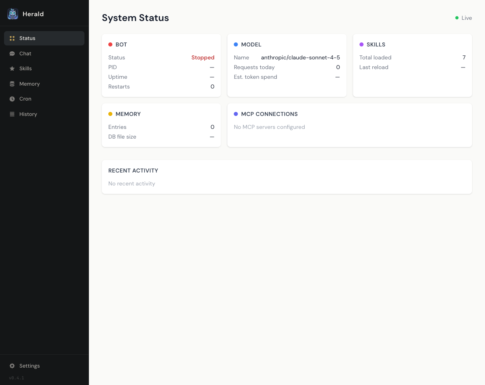
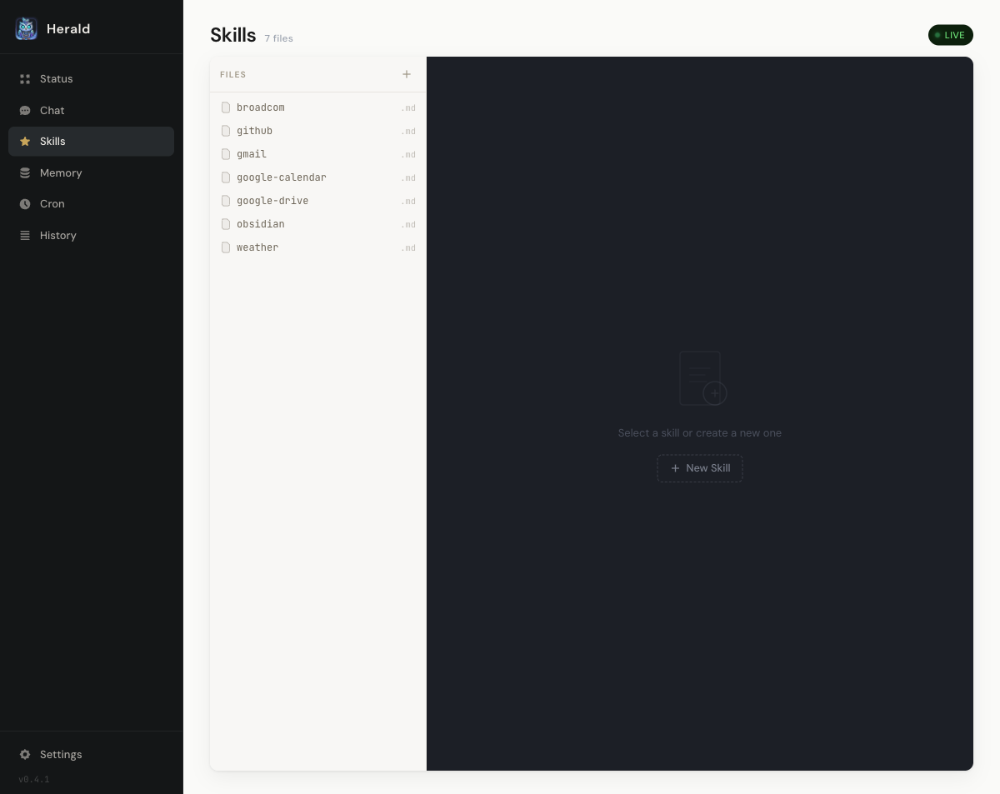
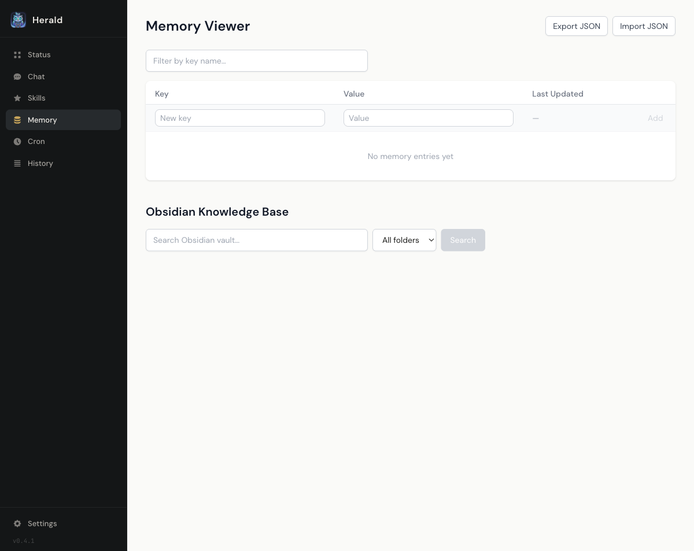
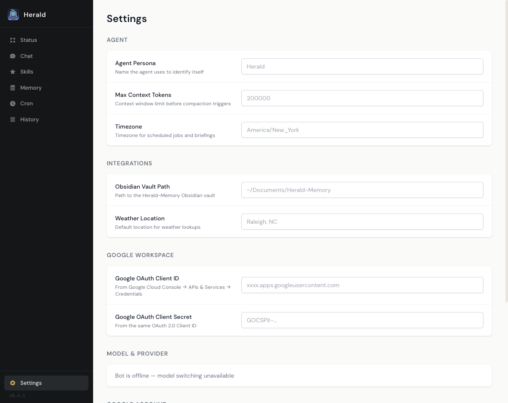
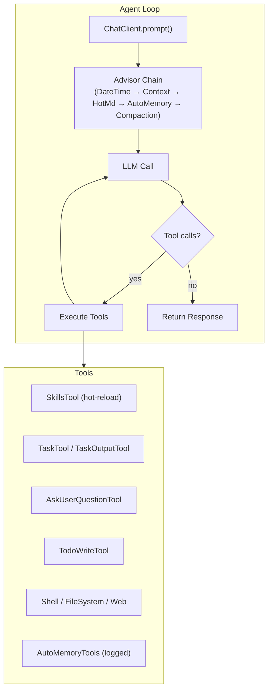
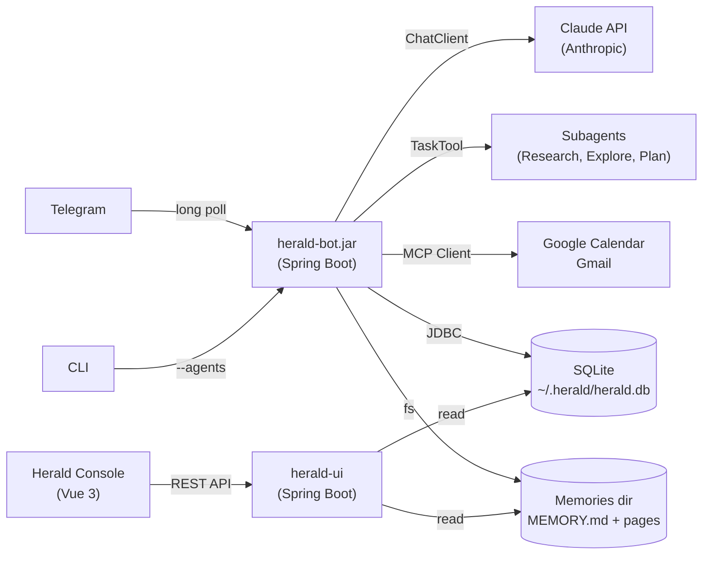
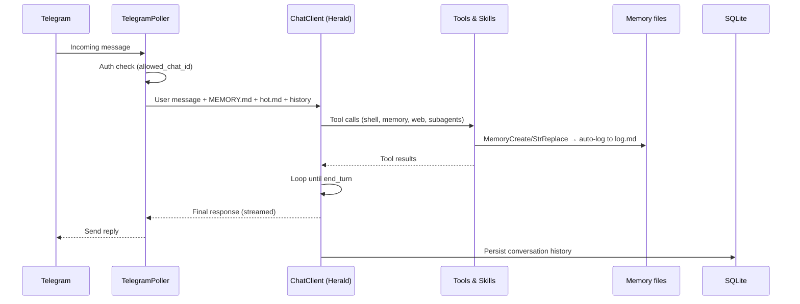
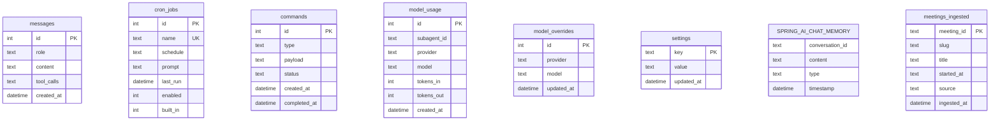

<p align="center">
  
</p>

# Herald

**A hackable AI agent that works two ways — a Telegram-native personal assistant that learns over time, or a single-shot task runner that exits when it's done.** Same JAR, same agent loop, same tool system. What changes is what you plug in.

> Need the "why bother" pitch first? → [**Why Run Herald**](docs/why-herald.md)


---

## What can Herald do?

Real interactions, not abstractions:

```
You:     "What did that Karpathy gist about LLM wikis say?"
Herald:  Runs wiki-query → grep /sources/, loads 2 pages, answers with
         citations: "see [sources/karpathy-wiki](sources/karpathy-wiki.md)"

You:     "Ingest this into memory: https://blog.example.com/post"
Herald:  Runs wiki-ingest → fetches the URL, creates sources/post.md
         with takeaways, updates related concepts/ and entities/ pages,
         logs the event to log.md

You:     "Brief me on my week"
Herald:  (scheduled at 07:00 Mon) — pulls Gmail, Calendar, pending
         GitHub PRs, synthesizes via the research subagent, sends you
         a single message

You:     /save phase-e-shipped
Herald:  Files the current conversation into long-term memory as a
         wiki note — concepts, entities, takeaways, all cross-linked

$ java -jar herald-bot.jar --agents=cf-analyzer.md \
    --prompt="analyze this Cloud Foundry manifest and flag risks"
# Exits with the analysis. No DB, no Telegram, no daemon.
```

## Herald Console

Browse long-term memory grouped by type, edit skills with live reload, and manage cron jobs — all from a Vue 3 web UI.

| System Status | Skills Editor |
|:---:|:---:|
|  |  |

| Memory Viewer | Settings |
|:---:|:---:|
|  |  |

## Table of Contents

- [Why Herald](#why-herald)
- [Agentic Patterns — Spring AI Agent Utils](#agentic-patterns--spring-ai-agent-utils)
- [Quick Start](#quick-start)
- [Features](#features)
- [The Memory System](#the-memory-system)
- [Skills](#skills)
- [MeetingNotes Integration](#meetingnotes-integration)
- [Telegram Commands](#telegram-commands)
- [Architecture](#architecture)
- [Getting Started](#getting-started)
- [Environment Variables](#environment-variables)
- [Task Agent Mode](#task-agent-mode)
- [Project Structure](#project-structure)
- [Technology Stack](#technology-stack)
- [Contributing](#contributing)
- [License](#license)

## Why Herald

Most agent projects pick one personality: "chatty assistant" **or** "scripted task runner." Herald runs both off the same codebase because the split is just configuration, not architecture:

- **Personal assistant** — Telegram bot token + allowed chat ID. Runs 24/7 with the default SQLite memory path and cron, builds long-term memory of who you are via typed Markdown files, and can opt into Gmail, Calendar, and other integrations.
- **Task agent** — `--agents=my-agent.md`. One-shot or REPL, zero persistence, exits when done. The agent file defines the personality, tools, and model.
- **Hybrid** — run assistant mode with persistence but no Telegram, or disable persistence and keep only explicitly configured assistant capabilities. Task mode always keeps assistant persistence, Telegram, and schedulers off.

The reference implementation of [Spring AI's Agentic Patterns](https://spring.io/blog/2026/01/13/spring-ai-generic-agent-skills/) series, adapted for personal use.

## Agentic Patterns — Spring AI Agent Utils

Herald is a reference implementation of the architectural patterns in the [Spring AI Agentic Patterns](https://spring.io/blog/2026/01/13/spring-ai-generic-agent-skills/) blog series by Christian Tzolov. The series documents the [spring-ai-agent-utils](https://github.com/spring-ai-community/spring-ai-agent-utils) toolkit — composable building blocks for AI agents, inspired by Claude Code's architecture. Herald adopts all seven patterns, adapting each for a Telegram-native, always-on personal assistant.

### Blog Series

1. **Part 1**: [Agent Skills — Modular, Reusable Capabilities](https://spring.io/blog/2026/01/13/spring-ai-generic-agent-skills/)
2. **Part 2**: [AskUserQuestionTool — Agents That Clarify Before Acting](https://spring.io/blog/2026/01/16/spring-ai-ask-user-question-tool/)
3. **Part 3**: [TodoWriteTool — Why Your AI Agent Forgets Tasks](https://spring.io/blog/2026/01/20/spring-ai-agentic-patterns-3-todowrite/)
4. **Part 4**: [Subagent Orchestration — Hierarchical Agent Architectures](https://spring.io/blog/2026/01/27/spring-ai-agentic-patterns-4-task-subagents/)
5. **Part 5**: [A2A Protocol — Building Interoperable Agents](https://spring.io/blog/2026/01/29/spring-ai-agentic-patterns-a2a-integration/)
6. **Part 6**: [AutoMemoryTools — Persistent Agent Memory Across Sessions](https://spring.io/blog/2026/04/07/spring-ai-agentic-patterns-6-memory-tools/)
7. **Part 7**: [Session API — Event-Sourced Short-Term Memory with Context Compaction](https://spring.io/blog/2026/04/15/spring-ai-session-management/)

> **Deep dive:** See [docs/herald-patterns-comparison.md](docs/herald-patterns-comparison.md) for a feature-by-feature comparison of every blog pattern against Herald's implementation.

### The Pattern

Truly agentic behavior emerges from composition — not a single monolithic prompt, but a set of small, focused tools and advisors the LLM orchestrates through its tool-calling loop:


```mermaid
flowchart TB
    subgraph Agent Loop
        A["ChatClient.prompt()"] --> B["Advisor Chain<br/>(DateTime → Context → HotMd → AutoMemory → Compaction)"]
        B --> C["LLM Call"]
        C --> D{Tool calls?}
        D -->|yes| E["Execute Tools"]
        E --> C
        D -->|no| F["Return Response"]
    end

    subgraph Tools
        G["SkillsTool (hot-reload)"]
        H["TaskTool / TaskOutputTool"]
        I["AskUserQuestionTool"]
        J["TodoWriteTool"]
        K["Shell / FileSystem / Web"]
        L["AutoMemoryTools (logged)"]
    end

    E --> Tools
```

### Pattern Coverage

| Pattern | Blog Post | Status | Herald Implementation |
|---------|-----------|--------|----------------------|
| **Agent Skills** | [Part 1](https://spring.io/blog/2026/01/13/spring-ai-generic-agent-skills/) | ✅ ↗ | `ReloadableSkillsTool` wraps upstream `SkillsTool` with a `WatchService`-based hot-reload (`SkillsWatcher`, 250ms debounce). Skills live in `skills/` as Markdown + YAML front matter. |
| **AskUserQuestion** | [Part 2](https://spring.io/blog/2026/01/16/spring-ai-ask-user-question-tool/) | ✅ | Upstream `AskUserQuestionTool` with `TelegramQuestionHandler` implementing `QuestionHandler`. Single-select options render as inline keyboard buttons; multi-select and free-text fall back to text messaging. Blocks on `CompletableFuture` with a 30-minute timeout (`herald.telegram.question-timeout-minutes`). The agent turn runs on a dedicated executor so a pending question never stalls Telegram polling. |
| **TodoWrite** | [Part 3](https://spring.io/blog/2026/01/20/spring-ai-agentic-patterns-3-todowrite/) | ✅ | Upstream `TodoWriteTool` with `pending → in_progress → completed` states. A `todoEventHandler` dispatches formatted progress to `MessageSender` (Telegram) with status symbols, or prints to stdout when no transport is configured. |
| **Subagent Orchestration** | [Part 4](https://spring.io/blog/2026/01/27/spring-ai-agentic-patterns-4-task-subagents/) | ✅ | `TaskTool` + `TaskOutputTool` with multi-model tier routing. Uses all four built-in subagents (Explore, General-Purpose, Plan, Bash) plus a custom **research** agent (Opus, deep analysis + web search) in `.claude/agents/`. |
| **A2A Protocol** | [Part 5](https://spring.io/blog/2026/01/29/spring-ai-agentic-patterns-a2a-integration/) | ✅ | Enable `herald.a2a.client.enabled`, then configure remote agents under `herald.a2a.agents`; each is registered alongside local subagents and dispatched through the same `TaskTool`. |
| **AutoMemoryTools** | [Part 6](https://spring.io/blog/2026/04/07/spring-ai-agentic-patterns-6-memory-tools/) | ✅ ↗ | Herald-owned `HeraldAutoMemoryAdvisor` replaces the upstream advisor and decorates each mutating `ToolCallback` so successful ops append to `log.md`. Extended taxonomy (`concept`, `entity`, `source`) beyond the blog's four types. `MEMORY.md` is a type-grouped catalog. Sibling `wiki-ingest` / `wiki-query` / `wiki-lint` skills close the compounding-knowledge loop. Optional `obsidian-vault` mode switches new pages to `[[wikilinks]]`. |
| **Session API** | [Part 7](https://spring.io/blog/2026/04/15/spring-ai-session-management/) | ⏳ | Targets Spring AI 2.1 (Nov 2026). Today Herald uses `OneShotMemoryAdvisor` + `ContextCompactionAdvisor` over `ChatMemory`/`MessageWindowChatMemory` — functionally similar (windowed history + auto-compaction) but lacks turn-safe boundaries, pluggable compaction strategies, and `conversation_search`. Migration tracked in the comparison doc. |

**Legend:** ✅ Adopted — ↗ Herald extension beyond upstream — ⏳ Planned

### Herald-Specific Extensions

Beyond the seven blog patterns, Herald adds capabilities specific to an always-on personal assistant:

| Extension | Description |
|-----------|-------------|
| **Advisor chain** | Layered `CallAdvisor` pipeline: `DateTimePromptAdvisor` → `ContextMdAdvisor` (standing brief from `~/.herald/CONTEXT.md`) → `HotMdAdvisor` (session-continuity note) → `HeraldAutoMemoryAdvisor` (memory tools + MEMORY.md) → `ContextCompactionAdvisor` (compacts near token limits; writes summary to `log.md` + refreshes `hot.md`) → `OneShotMemoryAdvisor` (conversation history) |
| **Compounding wiki skills** | `wiki-ingest` / `wiki-query` / `wiki-lint` turn the memories dir into a first-class knowledge base — ingest URLs/files/conversations, answer with citations, audit for orphans/staleness |
| **/save command** | Files the current Telegram conversation into long-term memory as a wiki note, with slug hint support |
| **Proactive scheduling** | `CronService` runs agent prompts on schedules — briefings, reminders, outreach with no user input |
| **Shell security** | `HeraldShellDecorator` with regex blocklist, Telegram confirmation gate for `sudo`/system writes, sensitive-value redaction, configurable timeouts |
| **Runtime model switching** | `/model` (Telegram) or the console's per-provider model dropdown switches between Anthropic, OpenAI, Ollama, Gemini, LM Studio at runtime; persisted in the `model_overrides` table. Each provider exposes a configurable model catalog (`HERALD_MODEL_CATALOG_<PROVIDER>`) |
| **Management console** | Vue 3 web UI for skills editing, file-based memory browsing grouped by type, cron jobs, conversation history, live status via SSE |
| **Google Workspace** | Gmail, Calendar, Drive, Docs, Sheets, Tasks, and Contacts via the `gws` CLI — single-source `.env` creds, `./run.sh auth`, in-console Connect Google, error→action hints |
| **Multi-tier model routing** | Haiku / Sonnet / Opus tiers configured per subagent type so cheap work uses cheap models |

### Tool Registration Architecture

Herald separates tools into two categories matching how Spring AI handles them:

- **`@Tool`-annotated POJOs** (via `.defaultTools()`) — `HeraldShellDecorator`, `FileSystemTools`, `WebTools`, `AskUserQuestionTool` (upstream), `TodoWriteTool` (upstream), `CronTools`, `GwsTools`, `TelegramSendTool`
- **Raw `ToolCallback` objects** (via `.defaultToolCallbacks()`) — `TaskTool`, `TaskOutputTool`, `ReloadableSkillsTool`, and the logging-decorated memory callbacks from `HeraldAutoMemoryAdvisor`

## Quick Start

**Task agent in 60 seconds** — no Telegram, no database required:

```bash
# 1. Build
git clone https://github.com/dbbaskette/herald.git && cd herald
./scripts/build.sh

# 2. Create a minimal agent
cat > hello-agent.md << 'EOF'
---
name: hello-agent
description: A friendly assistant with filesystem access
model: sonnet
tools: [filesystem]
---

You are a helpful assistant with access to the local filesystem.
EOF

# 3. Run it
export ANTHROPIC_API_KEY=sk-ant-...
java -jar "$(./scripts/find-artifact.sh bot)" --agents=hello-agent.md \
    --prompt="What's in the current directory?"
```

For the full personal-assistant experience with Telegram + memory, jump to [Getting Started](#getting-started).

> **New to Herald?** The [Getting Started 101 guide](docs/getting-started-101.md) walks you from zero to a running task agent in about ten minutes with no Spring/Java prerequisites.

## Features

**Chat surfaces**
- 🗨️ **Telegram-native** — chat where you already message; streaming replies, inline keyboards for agent-asked questions. Multimodal: send photos (Claude/GPT/Gemini vision), voice memos (transcribed locally via `whisper` if installed), and documents (PDFs via `pdftotext`).
- 💻 **Management console** — Vue 3 web UI for memory browsing, skills editing, cron jobs, live status via SSE
- ⌨️ **CLI task mode** — `--agents=file.md --prompt="..."` for one-shot execution, or drop the `--prompt` for a REPL

**Compounding long-term memory** (see [The Memory System](#the-memory-system))
- 📁 File-based memory with a typed taxonomy (`user`, `feedback`, `project`, `reference`, `concept`, `entity`, `source`)
- 🗂️ `MEMORY.md` is a grouped catalog — not a flat dump
- 📓 Append-only `log.md` records every memory mutation with timestamps
- 🔥 `hot.md` session-continuity note, auto-refreshed from compaction summaries
- 🔍 `wiki-ingest` / `wiki-query` / `wiki-lint` skills for write, read-with-citations, and health checks
- ✋ **Per-type approval gates** — concept/entity/source edits + every delete/rename send a diff preview to Telegram before the write lands; low-stakes types apply silently
- 📒 Opt-in Obsidian vault mode for `[[wikilinks]]` + Graph view; default stays portable

**Capabilities**
- 🧩 **Skills** — hot-reloaded Markdown files in `skills/` ([Agent Skills — Part 1](https://spring.io/blog/2026/01/13/spring-ai-generic-agent-skills/))
- 🕵️ **Subagents** — TaskTool delegation for Explore, Plan, Research, Bash ([Part 4](https://spring.io/blog/2026/01/27/spring-ai-agentic-patterns-4-task-subagents))
- **Optional MCP tools** — explicitly allowlisted remote callbacks in the real agent loop; [setup and fixture](docs/mcp-client.md).
- **Optional browser automation** — isolated browser sessions, approved actions and vision screenshots; [setup and boundaries](docs/integrations/browser.md).
- 🌐 **A2A protocol** — delegate to remote agents alongside local ones ([Part 5](https://spring.io/blog/2026/01/29/spring-ai-agentic-patterns-a2a-integration))
- ❓ **Clarify-before-act** — `AskUserQuestionTool` with Telegram inline-keyboard integration ([Part 2](https://spring.io/blog/2026/01/16/spring-ai-ask-user-question-tool))
- ✅ **Structured task tracking** — `TodoWriteTool` with per-step progress messages ([Part 3](https://spring.io/blog/2026/01/20/spring-ai-agentic-patterns-3-todowrite))
- ⏰ **Proactive scheduling** — morning briefings, reminders, cron-driven outreach
- 📧 **Google Workspace** — Gmail, Calendar, Drive, Docs, Sheets, Tasks, and Contacts via the `gws` CLI. One-command OAuth (`./run.sh auth`) or a **Connect Google** button in the console; credentials live solely in `.env`. Google API errors are mapped to actionable hints the agent surfaces to you (expired token → reconnect, missing scope, disabled API)
- 📋 **Apple Reminders** — read, create, complete, and delete reminders via the `reminders` CLI (macOS only); morning briefings surface today's + overdue items
- 📝 **MeetingNotes ingestion** — when a recording finishes in the [MeetingNotes](https://github.com/dbbaskette/MeetingNotes) app, a webhook files the full summary + action items into memory and turns your action items into reminders. A daily catch-up and a console **Bring into memory** button backfill anything missed — one small agent turn per meeting, so it's gentle on local models (see [MeetingNotes Integration](#meetingnotes-integration))
- 🐚 **Shell & file access** — with regex-blocked destructive commands, sensitive-value redaction, and confirmation gating

**Models**
- 🤖 **Multi-provider** — Anthropic, OpenAI, Gemini, Ollama (local), LM Studio (local). Switch at runtime with `/model` in Telegram or the console's per-provider model dropdown (each provider expands to a configurable catalog of models)
- 🔎 **LM Studio auto-discovery** — Herald queries LM Studio's native API for the models you have loaded, populates the picker, and targets the loaded model — at startup and via a **Rescan LM Studio** button (no restart). Swap the model in LM Studio and Herald follows
- 💰 **Tiered routing** — Haiku / Sonnet / Opus tiers for subagents so cheap work stays cheap
- 🔁 **Model failover chain** — opt-in `FailoverChatModel` transparently retries the next chain entry on 429 / 5xx / timeout / unavailable, with a per-entry circuit breaker

**Operational health**
- 🩺 **`./run.sh doctor`** — fast diagnostic battery (Java, API keys, DB integrity + WAL mode, memory dir, skills, optional CLIs, ports). Human / `--json` / `--quiet` output; exit `0` clean / `1` warnings / `2` failures
- 💸 **`/budget`** — daily and monthly spend caps, model ceiling, auto-pause when exceeded
- **Execution limits** — shared step, deadline, token and optional estimated cost bounds for main turns and [delegated workers](docs/subagent-execution.md); [configuration](docs/agent-execution.md).
- 📦 **Anthropic prompt caching** — `system_and_tools` strategy by default; large skills + tool catalog cached across turns for ~75% cost reduction on cache hits
- 🧹 **Daily memory consolidation** — once per UTC day, the first turn injects a reminder for the model to merge duplicate / drop stale memory pages

## The Memory System

File memory is the canonical learned store. The legacy SQLite key-value archive remains available for manual reference and backup; see [memory ownership](docs/memory-ownership.md).

Herald implements the compounding-knowledge pattern from [Karpathy's LLM Wiki gist](https://gist.github.com/karpathy/442a6bf555914893e9891c11519de94f) — memory that gets *more valuable* over time instead of turning into a scratchpad. Everything is plain Markdown on disk. No database, no lock-in.

```
$HERALD_MEMORIES_DIR/           # default ~/.herald/memories
├── MEMORY.md                   # catalog, grouped by type
├── log.md                      # append-only event log
├── hot.md                      # session-continuity cache
├── user_profile.md             # type: user
├── feedback_testing.md         # type: feedback
├── concepts/                   # type: concept (subdir convention)
│   └── hot_path.md
├── entities/                   # type: entity
│   └── jamie.md
└── sources/                    # type: source
    └── karpathy_wiki.md
```

**How pages get in:**
- **Automatically** — the agent calls `MemoryCreate` / `MemoryStrReplace` when it learns something worth keeping (user preferences, project decisions, non-obvious feedback). Every successful mutation auto-logs to `log.md`.
- **On demand** — `/save [name]` files the current conversation into memory via the `wiki-ingest` skill: extracts concepts/entities/takeaways, creates the right pages, updates the index.
- **Research auto-save** — the research subagent asks once after each synthesis whether to file the findings (URLs preserved for later citation).

**How pages get used:**
- **Every turn** — `MEMORY.md` is injected into the system prompt so the agent always sees the catalog. `hot.md` adds a short session-continuity summary.
- **On demand** — `wiki-query` skill greps the memories dir, loads top-ranked pages, answers with explicit page citations instead of training-data fabrication.
- **Health checks** — `wiki-lint` skill finds orphan pages, dead wikilinks, index mismatches, and (optionally, LLM-assisted) stale/contradicting claims. Emits a report; never mutates without confirmation. Cron-runnable.

**Obsidian vault mode** — opt-in via `HERALD_OBSIDIAN_VAULT_MODE=auto|on|off`. Point `HERALD_MEMORIES_DIR` at an Obsidian vault folder and new pages use `[[wikilinks]]` for Graph view + backlinks. Default stays `plain-markdown` so notes render correctly in GitHub, VS Code, and `cat`. Optional CSS and Bases-dashboard snippets under `assets/obsidian-snippets/` — copy in if you want, ignore otherwise.

## Skills

Skills are Markdown files with YAML front matter that teach Herald new capabilities without code changes. Drop a file into `skills/` and Herald picks it up immediately — no restart required.

```
skills/
├── wiki-ingest/       # Ingest URL/file/text → sources + concepts + entities
├── wiki-query/        # Search memory, answer with page citations
├── wiki-lint/         # Orphan/dead-link/stale-claim audit
├── markitdown/        # PDF / Office / HTML / image / audio → Markdown via markitdown CLI
├── voice-handling/    # Local audio → text via whisper (self-installing)
├── code-writer/       # Delegate coding tasks to Claude Code via `claude -p`
├── skill-browser/     # Browse + install skills from anthropics/skills on demand
├── optional-deps/     # Detect/install optional CLIs (whisper, pdftotext, ...)
├── skill-creator/     # Meta — create and iterate on skills
├── github/            # GitHub PR review and workflow helpers
├── gmail/             # Email composition and search (via gws CLI)
├── google-calendar/   # Calendar management (via gws CLI)
├── google-drive/      # Drive file operations (via gws CLI)
├── reminders/         # Apple Reminders (via reminders CLI, macOS only)
├── meeting-ingest/    # File a completed MeetingNotes meeting → memory + reminders
├── obsidian/          # Obsidian vault search (via obsidian CLI)
├── weather/           # Weather lookups (wttr.in)
└── broadcom/          # VMware / Broadcom knowledge base
```

Each skill follows this format:

```markdown
---
name: skill-name
description: When to use this skill (shown to the LLM for selection)
---

Instructions, shell recipes, examples, and guardrails.
```

Herald's `ReloadableSkillsTool` wraps the upstream `SkillsTool` with a `WatchService`-based filesystem watcher (`SkillsWatcher`) that triggers a 250ms debounced reload on any file change. The Herald Console also provides a web-based skills editor with live reload status via SSE.

## MeetingNotes Integration

Herald turns [MeetingNotes](https://github.com/dbbaskette/MeetingNotes) (a local meeting recorder/transcriber/summarizer) into a memory feed: every recorded meeting becomes a durable note — full summary, attendees, action items — filed under a `## Meetings` index section, with your action items pushed to Apple Reminders.

**Three ways meetings get in:**

| Path | Trigger | When |
|---|---|---|
| **Webhook** (real-time) | MeetingNotes posts `meeting.completed` to `POST /api/meetings/ingest` | the moment a recording finishes processing |
| **Daily catch-up** | `@Scheduled` job re-scans completed meeting history | 6 pm (set `HERALD_MEETINGNOTES_CATCHUP_CRON`, `-` to disable) — backstops anything the webhook missed |
| **Backfill** | console **Settings → Meetings → Bring into memory** (or `POST /api/meetings/backfill?days=N`) | on demand, for a date range |

**Design notes:**
- **One meeting per turn.** Each meeting is enriched in its own small, focused agent turn — never one giant batch — so it stays light on context and won't OOM a local model. The backfill loops in Java and runs them **sequentially**.
- **Reads MeetingNotes' durable output, not a live API.** The date-query backstop reads the app's read-only SQLite catalog + on-disk `summary.md` directly, so it works whether or not MeetingNotes is running. Herald never writes to the MeetingNotes database.
- **Full summary, verbatim.** MeetingNotes already distilled the transcript, so the note stores that summary complete — no summarizing the summary.
- **Dedup ledger.** A `meetings_ingested` table ensures a meeting that arrives via both the webhook and a catch-up is enriched exactly once; a failed enrichment releases its claim so it can retry.
- **Unattended writes auto-apply.** Webhook/catch-up/backfill turns run as a `SYSTEM` channel, so memory writes skip the interactive approval prompt (there's no human to answer it).

See [durable recovery, progress and optional recap/Reminders delivery](docs/integrations/meeting-recovery.md).

**Enable it** — set `HERALD_MEETINGNOTES_ENABLED=true`. In the MeetingNotes app → Settings → Webhook exporter: toggle on, set the URL to `http://127.0.0.1:8081/api/meetings/ingest`, template **Compact**, owner filter `all`. Paths default to `~/Documents/MeetingNotes`; override with `HERALD_MEETINGNOTES_DB_PATH` / `HERALD_MEETINGNOTES_DIR`. Set `HERALD_MEETINGNOTES_ENABLED=false` to remove the API, catalog, recovery, catch-up, ingestion, and their probes while preserving queued data.

## Telegram Commands

| Command | What it does |
|---------|-------------|
| `/help` | Show all available commands |
| `/status` | System status: uptime, model, active tools |
| `/save [name]` | File the current conversation into long-term memory |
| `/memory` | Pointer — memory is managed by the agent via long-term memory files |
| `/debug` | Context size, memory count, tools count |
| `/reset` | Clear conversation history (long-term memory preserved) |
| `/model status` | Show current provider and model + daily token usage |
| `/model <provider> <model>` | Switch model at runtime |
| `/skills list` | Show all loaded skills |
| `/skills reload` | Force reload skills from disk |
| `/cron list` | List all cron jobs with schedules |
| `/cron enable <name>` | Enable a cron job |
| `/cron disable <name>` | Disable a cron job |
| `/cron edit <name> schedule <expr>` | Update a cron schedule |
| `/confirm <id> yes\|no` | Approve or deny a pending action |
| `/think low\|medium\|high\|off\|status` | Set Anthropic extended-thinking budget tier |
| `/compact [now\|status]` | Force-compact conversation history or show current token usage |
| `/trace on\|off\|status` | Toggle prompt-dump tracing (dumps to `~/.herald/prompt-dump/`) |
| `/why` | Explain the agent's reasoning for the previous turn (high-budget thinking) |
| `/budget [daily $X \| monthly $X \| model-ceiling haiku\|sonnet\|opus\|off \| clear <field> \| pause \| resume \| status]` | Spending rails — caps, model ceiling, pause/resume |

## Architecture


```mermaid
flowchart LR
    A["Telegram"] -->|long poll| B["herald-bot.jar<br/>(Spring Boot)"]
    B -->|ChatClient| C["Claude API<br/>(Anthropic)"]
    B -->|TaskTool| D["Subagents<br/>(Research, Explore, Plan)"]
    B -->|MCP Client| E["Google Calendar<br/>Gmail"]
    B -->|JDBC| F[("SQLite<br/>~/.herald/herald.db")]
    B -->|fs| M[("Memories dir<br/>MEMORY.md + pages")]
    G["Herald Console<br/>(Vue 3)"] -->|REST API| H["herald-ui<br/>(Spring Boot)"]
    H -->|read| F
    H -->|read| M
    I["CLI"] -->|--agents| B
```

Herald is a modular Spring Boot monorepo. One JAR (`herald-bot.jar`) does everything — what it does depends on what you configure:

| Module | Role | Depends on |
|--------|------|------------|
| **herald-core** | Agentic loop, advisors, tools, AgentFactory, CLI runner | Spring AI |
| **herald-persistence** | SQLite, memory advisors, cron, compaction | herald-core + JDBC |
| **herald-telegram** | Telegram transport, commands, question handler | herald-core + herald-persistence |
| **herald-bot** | Thin wiring — assembles all modules into one executable | All modules |
| **herald-ui** | Management console (REST API + Vue 3) | herald-persistence |

| Configuration | What Herald becomes |
|---------------|-------------------|
| Nonblank `bot-token` + `allowed-chat-id` | Personal assistant (Telegram + default memory + cron) |
| Persistence enabled with Telegram blank | Persistent agent without Telegram (REST API) |
| `--agents=file.md` | Task agent (one-shot or REPL, no persistence) |
| `--agents=file.md --prompt="..."` | Single-prompt execution, exits when done |

### Data Flow


```mermaid
sequenceDiagram
    participant T as Telegram
    participant P as TelegramPoller
    participant A as ChatClient (Herald)
    participant Tools as Tools & Skills
    participant Mem as Memory files
    participant DB as SQLite

    T->>P: Incoming message
    P->>P: Auth check (allowed_chat_id)
    P->>A: User message + MEMORY.md + hot.md + history
    A->>Tools: Tool calls (shell, memory, web, subagents)
    Tools->>Mem: MemoryCreate/StrReplace → auto-log to log.md
    Tools-->>A: Tool results
    A->>A: Loop until end_turn
    A-->>P: Final response (streamed)
    P-->>T: Send reply
    A->>DB: Persist conversation history
```

## Getting Started

### Remote access

Both services now listen on loopback by default. For your phone or another computer, use the [Tailscale/SSH remote-access guide](docs/remote-access.md), enable optional console authentication, and follow the [security checklist](docs/security-checklist.md). Run `./run.sh config validate` to check effective console exposure settings.


This guide walks you through setting up the full Telegram + memory + cron experience.

> **Brand new to Herald?** Start with the [Getting Started 101 guide](docs/getting-started-101.md) — task agent in ten minutes, no Telegram, no DB, no Spring/Java experience required.

### Prerequisites

| Requirement | Version | Check |
|-------------|---------|-------|
| **macOS** | Any recent | — |
| **Java JDK** | 21+ | `java -version` |
| **Maven** | 3.9+ (wrapper included) | `./mvnw -version` |
| **Node.js** (console build only) | 22.23.1 (see `.nvmrc`) | `node -v` |
| **npm** | 10+ | `npm -v` |

You will also need:

- **Anthropic API key** — [console.anthropic.com](https://console.anthropic.com)
- **Telegram bot token** — via [@BotFather](https://t.me/BotFather)

### Step 1 — Create a Telegram bot

1. Open Telegram and message [@BotFather](https://t.me/BotFather)
2. Send `/newbot` and follow the prompts
3. Copy the **bot token** BotFather gives you
4. Message your new bot, then visit `https://api.telegram.org/bot<YOUR_TOKEN>/getUpdates` to find your **chat ID** in the response JSON

### Step 2 — Clone and build

```bash
git clone https://github.com/dbbaskette/herald.git
cd herald
./scripts/build.sh
```

Builds and verifies all modules: `herald-core`, `herald-persistence`, `herald-telegram`, `herald-bot`, `herald-ui`. Use Java 21 and Node 22.23.1 (`nvm install && nvm use`). The build runs lockfile-based `npm ci`; no credentials or running integrations are required. See [Building and installing](docs/building.md) for the shared local/CI/package path.

### Step 3 — Configure

**Recommended: interactive wizard.**

```bash
./run.sh onboard
```

Walks you through the Anthropic API key, Telegram bot token, chat ID
auto-detection (just send your bot a message — the wizard polls Telegram for
you), memory directory, and optional Google Workspace OAuth credentials.
Idempotent — re-run anytime to update values without clobbering hand-edits.

**Or, manual:**

```bash
cp .env.example .env
```

Fill in the three required values:

```bash
ANTHROPIC_API_KEY=sk-ant-...
HERALD_TELEGRAM_BOT_TOKEN=123456:ABC-DEF...
HERALD_TELEGRAM_ALLOWED_CHAT_ID=your-chat-id
```

`.env.example` documents all optional variables. `.env` is gitignored.

### Step 4 — Run

```bash
./run.sh           # starts both bot + ui (default)
./run.sh bot       # bot only (port 8081)
./run.sh ui        # ui only (port 8080)
./run.sh stop      # stops everything (broad sweep — see below)
./run.sh restart [bot|ui|all]
./run.sh build     # clean build and verification (same as ./scripts/build.sh)
./run.sh doctor    # diagnose common misconfig (--json, --quiet)
./run.sh onboard   # interactive setup wizard (writes .env)
./run.sh auth [scopes]  # Google OAuth — one flow for all Workspace scopes
```

`bot`, `ui`, and `all` **recompile the requested modules first** (via `mvn -am install -DskipTests`), so local edits in shared modules are always picked up. They also **kill any prior Herald instances** before starting — stale `./run.sh` shells, orphaned `mvn`/`spring-boot:run` JVMs, leftover log tails, and anything on ports 8080/8081 — so you never end up with two bots polling Telegram at once. `./run.sh stop` runs the same broad sweep.

**If something breaks, run `./run.sh doctor` first.** It checks Java, API keys,
the SQLite file, memory dir, skills, optional CLIs (gws, reminders, whisper,
pdftotext, gh), and ports — prints a concise pass/warn/fail report with fix
hints. Exit codes `0` / `1` / `2` make it safe to wire into CI or `pre-start`
hooks.

Send your bot a message on Telegram — you should get a response from Claude.

**Sanity checks:**

- `/status` — shows uptime, active model, active tools
- `/help` — lists every command
- "What can you do?" — free-text message gets a normal agent reply

### Step 5 — Install as a macOS service (optional)

To run 24/7 as a background `launchd` agent:

```bash
make check-env   # verify required env vars
make install     # build, install, start the service
```

Manage it with:

```bash
make start | stop | restart | logs | uninstall
```

Logs land in `~/Library/Logs/herald.log`.

### Step 6 — Start the console (optional)

```bash
./scripts/build.sh
java -jar "$(./scripts/find-artifact.sh ui)"
```

See [Console scheduling, skills and memory](docs/console-editing.md) for validation, recoverable memory edits and run-state behavior. [Memory ownership and retention](docs/memory-ownership.md) explains canonical file memory and the separate legacy SQLite reference entries.

Then open [http://localhost:8080](http://localhost:8080). The console requires Safari 16.4+, Chrome 111+, or Firefox 128+ for Tailwind CSS 4. Node is required to build the console assets, but not to run the packaged Java application.

### Step 7 — Google Workspace (optional)

Herald talks to Gmail, Calendar, Drive, Docs, Sheets, Tasks, and Contacts through the [`gws` CLI](https://github.com/googleworkspace/google-workspace-cli) (`brew install googleworkspace-cli`).

**`.env` is the single source of truth for the OAuth client.** Set the two values, and `./run.sh` keeps `~/.config/gws/client_secret.json` in sync automatically:

```bash
# In .env — from Google Cloud Console → APIs & Services → Credentials → OAuth 2.0 Client ID (Desktop):
GOOGLE_WORKSPACE_CLI_CLIENT_ID=...apps.googleusercontent.com
GOOGLE_WORKSPACE_CLI_CLIENT_SECRET=GOCSPX-...
HERALD_GOOGLE_ENABLED=true
```

Then authenticate — one flow covers every scope Herald uses:

```bash
./run.sh auth          # gmail,calendar,drive,docs,sheets,tasks,people
./run.sh auth gmail,calendar   # or limit to specific services
```

Or click **Connect Google** on the console's Settings page (`http://localhost:8080`) — it drives the same OAuth flow and shows your connected account, scopes, and GCP project once linked.

When a Google call fails, Herald maps the error to an actionable hint the agent relays to you — e.g. *token expired → reconnect*, *missing scope*, or *API not enabled in this GCP project*. Headless/container deployments can switch to the encrypted-file keyring (`GOOGLE_WORKSPACE_CLI_KEYRING_BACKEND=file`). Full walkthrough: [docs/gws-setup.md](docs/gws-setup.md).

## Environment Variables

| Variable | Description | Required | Default |
|----------|-------------|----------|---------|
| `ANTHROPIC_API_KEY` | Anthropic API key | One model provider required | — |
| `HERALD_TELEGRAM_BOT_TOKEN` | Bot token from @BotFather | Telegram only | — |
| `HERALD_TELEGRAM_ALLOWED_CHAT_ID` | Your Telegram chat ID | Telegram only | — |
| `OPENAI_API_KEY` | OpenAI API key | One model provider required | — |
| `GEMINI_API_KEY` | Google Gemini API key | One model provider required | — |
| `OLLAMA_BASE_URL` | Ollama server URL | One model provider required | — |
| `HERALD_DEFAULT_PROVIDER` | Boot-time provider (`anthropic`, `openai`, `gemini`, `ollama`, `lmstudio`); falls back to the first configured provider | No | `anthropic` |
| `HERALD_MODEL_DEFAULT` | Main agent model | No | `claude-sonnet-4-5` |
| `HERALD_MODEL_HAIKU` | Fast/cheap subagent tier | No | `claude-haiku-4-5` |
| `HERALD_MODEL_SONNET` | Mid-tier subagent | No | `claude-sonnet-4-5` |
| `HERALD_MODEL_OPUS` | High-capability subagent tier | No | `claude-opus-4-5` |
| `HERALD_MODEL_OPENAI` | OpenAI subagent tier | No | `gpt-4o` |
| `HERALD_MODEL_OLLAMA` | Ollama (local) subagent tier | No | `llama3.2` |
| `HERALD_MODEL_GEMINI` | Gemini subagent tier | No | `gemini-2.5-flash` |
| `LMSTUDIO_BASE_URL` | LM Studio OpenAI-compatible base URL — set to enable the provider + auto-discovery | One model provider required | — |
| `HERALD_MODEL_LMSTUDIO` | LM Studio model id (overridden by whatever's loaded once discovery runs) | No | `qwen/qwen3.5-35b-a3b` |
| `HERALD_MODEL_CATALOG_<PROVIDER>` | Comma-separated model list shown in the console switcher (`ANTHROPIC`, `OPENAI`, `GEMINI`, ...) | No | Curated per provider |
| `GOOGLE_WORKSPACE_CLI_CLIENT_ID` | OAuth client ID for Google Workspace (`.env` is the source of truth) | No | — |
| `GOOGLE_WORKSPACE_CLI_CLIENT_SECRET` | OAuth client secret | No | — |
| `GOOGLE_WORKSPACE_CLI_TOKEN` | Pre-obtained OAuth2 access token (alternate to the client-id flow) | No | — |
| `GOOGLE_WORKSPACE_CLI_CREDENTIALS_FILE` | Path to an OAuth/service-account JSON instead of `~/.config/gws/` | No | — |
| `GOOGLE_WORKSPACE_CLI_KEYRING_BACKEND` | Token storage: `keyring` (default) or `file` (headless/containers; needs `GOG_KEYRING_PASSWORD`) | No | `keyring` |
| `HERALD_GWS_SCOPES` | Default scope set for `./run.sh auth` | No | `gmail,calendar,drive,docs,sheets,tasks,people` |
| `HERALD_WEB_SEARCH_API_KEY` | Brave Search API key | No | — |
| `HERALD_CRON_TIMEZONE` | Timezone for cron scheduler | No | `America/New_York` |
| `HERALD_AGENT_PERSONA` | Override agent persona | No | Built-in default |
| `HERALD_AGENT_CONTEXT_FILE` | Path to standing brief | No | `~/.herald/CONTEXT.md` |
| `HERALD_WEATHER_LOCATION` | Location for weather tool | No | — |
| `HERALD_MEETINGNOTES_DB_PATH` | MeetingNotes read-only SQLite catalog (date-query backstop) | No | `~/Documents/MeetingNotes/db.sqlite` |
| `HERALD_MEETINGNOTES_DIR` | MeetingNotes library root (holds `meetings/{slug}/summary.md`) | No | `~/Documents/MeetingNotes` |
| `HERALD_MEETINGNOTES_CATCHUP_CRON` | Daily meeting catch-up schedule (Spring cron); `-` disables | No | `0 0 18 * * *` |
| `HERALD_PERSISTENCE_ENABLED` | Create SQLite-backed assistant services | No | `true` |
| `HERALD_CRON_ENABLED` | Register cron services and schedules when persistence is enabled | No | `true` |
| `HERALD_MEETINGNOTES_ENABLED` | Register all MeetingNotes ingestion, API, recovery, and catch-up components | No | `false` |
| `HERALD_GOOGLE_ENABLED` | Probe and register Google Workspace CLI tools | No | `false` |
| `HERALD_REMINDERS_ENABLED` | Probe and register Apple Reminders tools | No | `false` |
| `HERALD_A2A_CLIENT_ENABLED` | Register configured remote A2A agents for outbound delegation | No | `false` |
| `HERALD_A2A_SERVER_ENABLED` | Expose Herald's inbound A2A AgentCard and JSON-RPC endpoint | No | `false` |
| `HERALD_AGENT_MAX_CONTEXT_TOKENS` | Token limit before context compaction | No | `200000` |
| `HERALD_ANTHROPIC_CACHE_STRATEGY` | Anthropic prompt-cache strategy: `none` / `tools_only` / `system_only` / `system_and_tools` / `conversation_history` | No | `system_and_tools` |
| `HERALD_MEMORY_CONSOLIDATION_TRIGGER` | First-turn-of-day memory consolidation reminder: `daily` / `off` | No | `daily` |
| `HERALD_TELEGRAM_QUESTION_TIMEOUT_MINUTES` | How long an `AskUserQuestion` waits for a Telegram reply | No | `30` |
| `HERALD_MODEL_FAILOVER_ENABLED` | Enable opt-in failover chain (configure chain in `application.yaml`) | No | `false` |
| `HERALD_SHELL_REQUIRE_CONFIRMATION` | Prompt before risky commands (sudo / system writes / pipe-to-shell). `false` = fully autonomous (catastrophic blocklist still applies) | No | `true` |
| `HERALD_SERVER_PORT` | Port for the bot's actuator / health endpoint | No | `8081` |
| `HERALD_MEMORIES_DIR` | Long-term memory directory (can be an Obsidian vault folder) | No | `~/.herald/memories` |
| `HERALD_OBSIDIAN_VAULT_PATH` | Obsidian vault path for vault-aware tools/skills | No | — |
| `HERALD_OBSIDIAN_VAULT_MODE` | Link style for new memory pages: `auto` / `on` / `off` | No | `auto` |
| `HERALD_CONFIG` | Override config file path | No | `~/.herald/herald.yaml` |

## Task Agent Mode

Pass `--agents=` to the same `herald-bot.jar` and it becomes a task agent. No Telegram, no database, no long-running process. The `agents.md` file defines everything: personality, tools, model.

### Quickstart

1. **Create an agent definition** (`my-agent.md`):
   ```yaml
   ---
   name: my-agent
   description: A helpful assistant
   model: sonnet
   tools: [filesystem, web]
   ---

   You are a helpful assistant with access to the filesystem and web.
   ```

2. **Set your API key:**
   ```bash
   export ANTHROPIC_API_KEY=sk-...
   ```

3. **Run it:**
   ```bash
   # Single prompt — runs the task, prints the result, exits
   java -jar herald-bot.jar --agents=my-agent.md --prompt="List files in /tmp"

   # Interactive REPL — type prompts, get responses, Ctrl+D to exit
   java -jar herald-bot.jar --agents=my-agent.md
   ```

Configure one model provider: an Anthropic, OpenAI, or Gemini API key, or an Ollama or LM Studio base URL. Task mode deliberately leaves assistant integrations off even if their normal-mode flags, paths, or credentials are present:

| Task-mode input | What Herald does |
|-------------|-----------------|
| One configured model provider | In-memory conversation and console I/O |
| `tools` in the agent definition | Adds only the requested task tools |
| Assistant persistence, Telegram, cron, MeetingNotes, Google, or Reminders configuration | Keeps those long-running integrations disabled in task mode |

See [`examples/`](examples/) for ready-to-use agent definitions (`cf-analyzer.md`, `code-reviewer.md`, `csv-reporter.md`, `report-writer.md`) and [`docs/agents-md-spec.md`](docs/agents-md-spec.md) for the full format.

## A2A Agents (remote subagents)

Herald can delegate to remote A2A-compliant agents alongside its local subagents. The client is explicitly opt-in; enable it and declare each remote agent under `herald.a2a.agents` in `herald.yaml`:

```yaml
herald:
  a2a:
    client:
      enabled: true
    agents:
      - name: airbnb-agent
        url: http://localhost:10001/airbnb
        metadata:
          authorization: "Bearer some-token"
      - name: weather-agent
        url: http://localhost:10002/weather
```

- `name` is a local label used in startup logs. The real display name comes from the resolved `AgentCard`.
- `metadata` is an optional map passed verbatim to the underlying `SubagentReference`.
- Client and server switches are independent. Agent entries stay inactive unless `herald.a2a.client.enabled=true` (or `HERALD_A2A_CLIENT_ENABLED=true`). Herald resolves AgentCards while constructing the task tool; a bad endpoint therefore surfaces during enabled client startup.
- Full provider selection, optional capability, precedence, and restart behavior is in [Providers and capabilities](docs/provider-capabilities.md). Settings save/apply semantics are in [Console settings](docs/settings.md).

## Project Structure

```
herald/
├── pom.xml                          # Parent POM — Spring AI BOM, 5 modules
├── Makefile                         # Build, install, service management
├── herald-core/                     # Agentic loop foundation (zero persistence deps)
│   └── src/main/java/com/herald/
│       ├── agent/                   # AgentFactory, AgentService, advisors, ModelSwitcher
│       │   ├── profile/             # AgentProfile record, AgentProfileParser
│       │   └── subagent/            # HeraldSubagentReferences
│       ├── tools/                   # FileSystemTools, WebTools, ShellSecurityConfig
│       └── config/                  # HeraldConfig, ModelProviderConfig
├── herald-persistence/              # SQLite, memory advisors, cron
│   └── src/main/java/com/herald/
│       ├── agent/                   # HeraldAutoMemoryAdvisor, ContextCompactionAdvisor,
│       │                            #   MemoryLogWriter, LoggingMemoryToolCallback
│       ├── cron/                    # CronService, CronTools, BriefingJob
│       ├── tools/                   # HeraldShellDecorator, GwsTools
│       └── config/                  # DataSourceConfig, JsonChatMemoryRepository
├── herald-telegram/                 # Telegram transport
│   └── src/main/java/com/herald/
│       ├── telegram/                # Poller, sender, CommandHandler, question handler
│       └── tools/                   # TelegramSendTool
├── herald-bot/                      # Thin wiring module — the executable JAR
│   └── src/main/java/com/herald/
│       ├── HeraldApplication.java   # Spring Boot entry point
│       ├── agent/                   # HeraldAgentConfig (wiring)
│       └── api/                     # ChatController, ModelController
├── herald-ui/                       # Management console
│   ├── src/main/java/com/herald/ui/ # REST controllers, FileMemoryController, SSE
│   └── frontend/                    # Vue 3 + Vite + Tailwind
├── examples/                        # Example agents.md files
├── skills/                          # Reloadable skill definitions (see above)
├── assets/
│   ├── screenshots/                 # Console screenshots
│   └── obsidian-snippets/           # Optional CSS + Bases dashboard (vault-mode only)
├── .claude/agents/                  # Custom subagent definitions (research)
└── docs/
    ├── getting-started-101.md       # Ten-minute task-agent walkthrough
    ├── agents-md-spec.md            # agents.md format specification
    ├── herald-patterns-comparison.md
    └── gws-setup.md
```

## Technology Stack

| Component | Technology |
|-----------|------------|
| Language | Java 21 (virtual threads) |
| Framework | Spring Boot 4.1.1 |
| AI Framework | Spring AI 2.0.1 |
| Agent Utils | spring-ai-agent-utils / A2A 0.12.0 |
| Telegram | pengrad/java-telegram-bot-api 10.1.0 |
| Database | SQLite (WAL mode) |
| Console Frontend | Vue 3.5 + Vite 8 + Tailwind CSS 4 |
| Console Backend | Spring MVC + SSE |
| Process Management | macOS launchd |

Dependency versions, compatibility overrides and update checks are documented in [Dependency maintenance](docs/maintenance/dependencies.md).

### Database Schema


```mermaid
erDiagram
    messages {
        int id PK
        text role
        text content
        text tool_calls
        datetime created_at
    }
    cron_jobs {
        int id PK
        text name UK
        text schedule
        text prompt
        datetime last_run
        int enabled
        int built_in
    }
    commands {
        int id PK
        text type
        text payload
        text status
        datetime created_at
        datetime completed_at
    }
    model_usage {
        int id PK
        text subagent_id
        text provider
        text model
        int tokens_in
        int tokens_out
        datetime created_at
    }
    model_overrides {
        int id PK
        text provider
        text model
        datetime updated_at
    }
    settings {
        text key PK
        text value
        datetime updated_at
    }
    SPRING_AI_CHAT_MEMORY {
        text conversation_id
        text content
        text type
        datetime timestamp
    }
    meetings_ingested {
        text meeting_id PK
        text slug
        text title
        text started_at
        text source
        datetime ingested_at
    }
```

## Contributing

Contributions welcome! To get started:

1. Fork the repository
2. Create a feature branch (`git checkout -b feature/amazing-feature`)
3. Commit your changes (`git commit -m 'Add amazing feature'`)
4. Push to the branch (`git push origin feature/amazing-feature`)
5. Open a Pull Request

Before submitting, run `./scripts/build.sh`. It executes a clean Maven verification, including frontend typechecking, regression tests, asset generation, and executable-package comparison. See [Building and installing](docs/building.md).

## License

Distributed under the MIT License. See [LICENSE](LICENSE) for details.
